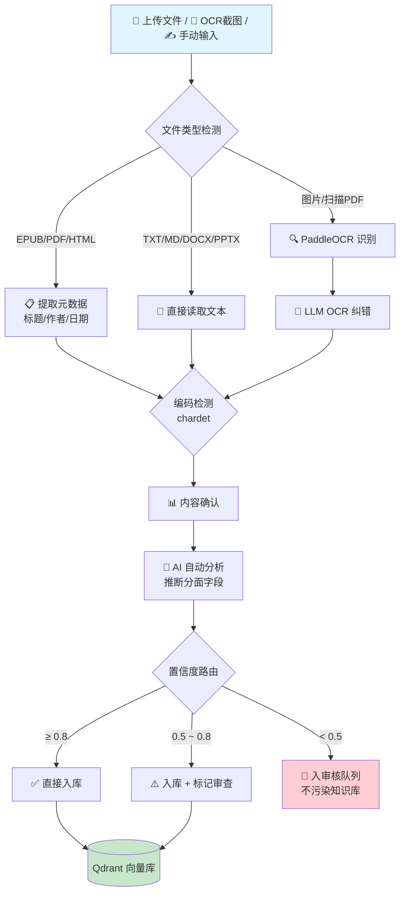
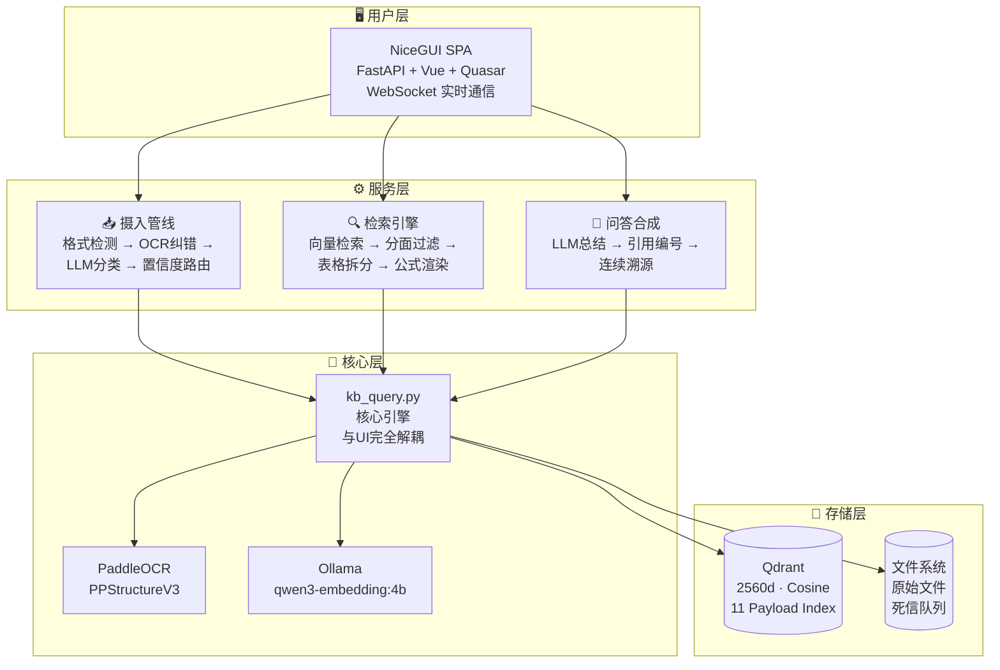
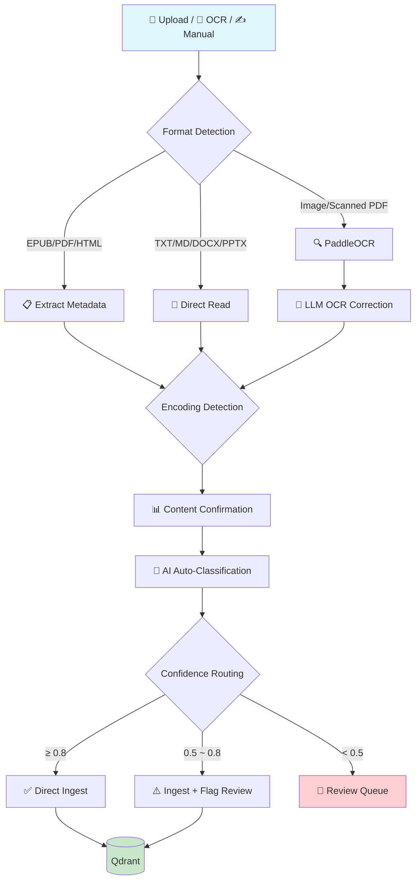
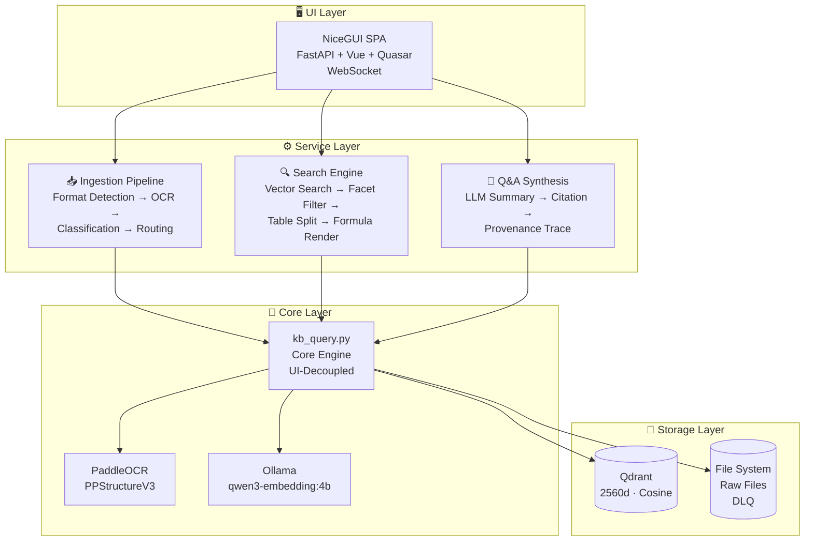

<p align="center">
  
</p>

<h1 align="center">Athanor · 熔知 / MindForge</h1>

<p align="center">
  <b>个人本地知识引擎</b><br>
  把截图、手册、笔记丢进去，问一个问题，直接得到<strong>带来源引用的答案</strong>。<br>
  数据全在本地，不联网也能用。
</p>

<p align="center">
  <a href="https://github.com/shiyao222333-afk/athanor"></a>
  <a href="https://github.com/shiyao222333-afk/athanor/blob/main/LICENSE"></a>
  
  <a href="https://github.com/shiyao222333-afk/athanor/stargazers"></a>
</p>

<p align="center">
  <b>🌐 Language:</b> &nbsp;
  <a href="#cn">🇨🇳 中文</a> &nbsp;|&nbsp;
  <a href="#en">🇬🇧 English</a>
</p>

<p align="center">
  <a href="#-为什么需要-athanor"><b>🤔 为什么需要</b></a> ·
  <a href="#-核心能力--竞品对比"><b>✨ 核心能力 & 竞品对比</b></a> ·
  <a href="#-操作流程"><b>🔄 操作流程</b></a> ·
  <a href="#-架构概览"><b>🏗️ 架构概览</b></a> ·
  <a href="#-路线图"><b>🗺️ 路线图</b></a> ·
  <a href="#-快速开始"><b>⚡ 快速开始</b></a> ·
  <a href="https://github.com/shiyao222333-afk/athanor/issues"><b>🐛 提 Issue</b></a>
</p>

---

<!-- ============================================================ -->
<!--                        CN VERSION                            -->
<!-- ============================================================ -->

<span id="cn"></span>

## 🤔 为什么需要 Athanor？

> **"有问题直接问 LLM（GPT/DeepSeek）不就行了，为什么要手动输入知识？"**

这是最重要的问题。答案一句话：

> **LLM 是「聪明的外人」，Athanor 是「读过你所有资料的私人助理」。**

| 问题 | 直接问 LLM | 用 Athanor |
|------|-----------|-------------------|
| 没有你的私有知识 | ❌ 它没读过 | ✅ 直接搜你本地资料 |
| 没有记忆 | ❌ 每次对话都是新的 | ✅ 越用越强 |
| 无法溯源 | ❌ 答案不知道从哪来 | ✅ 每个答案带 `[引用N]` |
| 数据隐私 | ❌ 上传云端 | ✅ 全本地运行 |

---

## ⚡ 3 秒快速体验

```bash
# 1. 克隆项目
git clone https://github.com/shiyao222333-afk/athanor.git && cd athanor

# 2. 安装依赖
pip install -r requirements.txt

# 3. 启动
python run.py
# → 浏览器访问 http://localhost:8080
# → 跟着向导建库 → 上传文件 → 开始提问！
```

> 💡 需要有 LLM API Key（DeepSeek / 通义千问 等均可），在「引擎配置」页面一键填写。入门指南见 [START.md](START.md)。

---

## ✨ 核心能力 & 竞品对比

> 以下逐一分析 Athanor 的核心能力与同类工具的实现差异。每个功能点都从「Athanor 怎么做」「竞品怎么解决」「差异在哪」三个角度展开。

---

### 📥 摄入 — 不只是上传文件，是理解文件

#### 🖼️ 中文 OCR + 公式 + 表格识别

**Athanor** 使用 PaddleOCR + PPStructureV3 进行版面分析，不仅识别文字，还能区分表格结构和公式区域，再用 LLM 对 OCR 易错字进行二次纠错（如「模数」→「模数」）。

**RAGFlow** 同样有强大的文档解析能力——DeepDoc 引擎使用 ONNX 版面分析模型 + pdfplumber 混合 OCR，表格识别用 TableStructureRecognizer 输出 HTML。定位相似，但侧重点不同：RAGFlow 面向企业级 PDF 批处理，Athanor 更聚焦个人混合素材（截图、扫描件、EPUB）的深度理解。

**FastGPT / Dify / AnythingLLM** 均无内置 OCR 或公式识别能力。Dify 依赖用户在工作流中自行编排外部提取步骤；FastGPT 仅支持纯文本文档分段。

> 💡 **差异**：Athanor 是同级工具中唯一将 OCR→LLM纠错→结构化提取→可靠摄入作为一条**自动化闭环**的，而不是让用户自己想办法处理。

---

#### 🤖 LLM 自动分类 — 四层推断管道

**Athanor** 摄入时不只是分块存向量，而是用 LLM 通过四层管道（模板默认值 → 文件元数据 → 关键词匹配 → LLM 兜底推断）自动推断每条知识的分面字段：content_type（15种）、domain（UDC 9主类）、temporal_nature（3级时效）、epistemic_status（L0-L2 验证层级）。用户只需确认或微调。 [→ FPF 认知层级 (arxiv 2601.21116)](docs/schema.md#分面4认知验证状态-epistemic_status必填)

**所有竞品均无此功能。** RAGFlow 的分块仅附带坐标标签，不做内容分类；Dify 的知识流水线由用户手动编排节点，没有自动推断；FastGPT 的 QA 模式用 LLM 生成问答对但不做分类；AnythingLLM 按工作区文件夹手动组织。

> 💡 **差异**：竞品的思路是「用户自己分类」，Athanor 是「AI 自动分类 + 用户审核」——从手动归档直接跳到半自动认知标注。

---

#### 📄 多格式智能检测 + 编码自检

**Athanor** 支持 8 种核心格式自动识别（EPUB/PDF/DOCX/PPTX/HTML/SRT/TXT/MD），通过扩展名 + 内容头 4 字节双重验证，并用 chardet 实现 UTF-8 → GBK → latin-1 编码兜底链，解决中文乱码痛点。 [→ 格式分层设计](PROJECT_PLAN.md#v045-计划--智能摄入深化-)

**RAGFlow / Dify** 同样支持多格式，走的是通用文档解析路线——RAGFlow 有 7 种解析器可选（DeepDoc/MinerU/Docling/PaddleOCR 等），Dify 通过知识流水线节点处理。但它们的格式检测是通用型的，不做元数据自动提取。

**FastGPT / AnythingLLM** 依赖基础的文本提取库，对 EPUB 等格式不友好，无编码自检。

> 💡 **差异**：Athanor 的格式检测不是为了「能读就行」，而是为了「读到能用」——EPUB 提取 Dublin Core 标题作者、PDF 提取 Document Info、HTML 提取 meta，省去手填元数据的步骤。

---

#### 🎯 置信度路由 + 死信队列

**Athanor** 设计了三档置信度路由机制：AI 分析置信度 ≥0.8 直接入库，0.5-0.8 入库但标记 `needs_review`，<0.5 进入审核队列不污染知识库。同时失败文件进入 Dead Letter Queue 保留现场，供人工检查。 [→ 置信度计算设计](PROJECT_PLAN.md#v045-计划--智能摄入深化-)

**所有竞品均无此机制。** RAGFlow、Dify、FastGPT 的摄入都是「全有或全无」——解析成功就入库，失败就报错丢弃，没有中间态。这在个人场景下尤其危险：用户不知道哪些内容被静默丢弃了。

> 💡 **差异**：这是 Athanor 在**个人知识管理场景**下的核心差异化设计——宁可不进，不要错进。面向企业批量处理的 RAG 引擎不需要这种粒度，因为它们假设输入是标准化的。

---

### 🔍 搜索 — 不只是向量匹配，是精确溯源

#### 📊 表格行级拆分 + 连续引用编号

**Athanor** 将大表格按**行**切分成独立检索单元，每行保留表头上下文。LLM 合成回答时引用精确到单元格，且 `[引用1][引用2]` 编号连续不跳跃，点击直达原文对应位置。

**竞品的 chunking 策略**都做不到这个粒度：
- **RAGFlow** 按 token 数（默认 512）切分，一份 3 页的表格可能被切成 2 个 chunk，检索时只能返回整块
- **Dify** 的父子分块模式（Parent-child）用大块做上下文、小块做检索，但不针对表格做行级拆分
- **FastGPT** 按分隔符 + 最大 token 数拆分，不识别表格结构
- **AnythingLLM** 的基础文本切分完全不考虑文档结构

> 💡 **差异**：竞品的思路是「切碎 → 拼回去」，Athanor 是「按语义单元切 → 精确索引」——表格不是文本块，是结构化数据。

---

#### 📐 KaTeX 服务端公式渲染

**Athanor** 用 PPStructureV3 识别公式区域 → LaTeX 转换 → KaTeX 服务端渲染为矢量 SVG，搜索结果中直接嵌入可缩放公式。

**RAGFlow** 对公式的支持不确定（当前文档未提及专门的公式识别流程，可能作为 figure 类型处理）。其他竞品均不处理公式——搜索「E=mc²」和搜索「能量质量关系」在它们的索引中没有区别。

> 💡 **差异**：对数学/工程类用户来说，公式是可检索的第一等公民，不是「图片附件」。Athanor 是同级工具中唯一在搜索链路中完整处理公式的。

---

### 🗂️ 知识组织 — 不是文件夹，是结构化认知

#### 🏷️ 分面分类 v5.0 (UDC + FPF)

**Athanor** 基于国际十进分类法（UDC）和 FPF 第一性原理框架，用 4 个维度精确标注每条知识：content_type（15 种） × domain（UDC 9 主类） × temporal_nature（3 级时效：evergreen/timeboxed/transient） × epistemic_status（L0 猜想 / L1 逻辑验证 / L2 实证验证）。每个维度都做了 Payload Index，支持组合过滤。 [→ UDC](https://www.udcsummary.info/) · [→ FPF (arxiv 2601.21116)](docs/schema.md)

**竞品均使用扁平分类**：
- **RAGFlow / FastGPT / AnythingLLM**：知识库 → 数据集 → 标签，本质是文件夹 + 标签的二维组织
- **Dify**：知识库 + 元数据字段（可自定义），但需手动维护，无自动推断

没有竞品区分「这是一条数学定理（evergreen/corroborated）」和「这是一条行业新闻（transient/unverified）」。

> 💡 **差异**：竞品的分类是「给文件打标签」，Athanor 是「给知识做体检」——你知道它是什么类型、多可靠、会过时吗。

---

#### 🔗 认知验证层级 + 通用关系

**Athanor** 记录每条知识的验证状态（L0 猜想 → L1 逻辑自洽 → L2 有外部实证），并支持 8 种关系类型（similar / references / contradicts / derived_from / merged_into / supersedes / depends_on），可以在知识之间建立引用链和矛盾链。 [→ 关系字段设计](docs/schema.md#知识管理字段8)

**Dify** 在工作流层面有关联能力（节点间数据流转），但不作用于知识条目之间。其余竞品均无条目间关系管理。

> 💡 **差异**：Athanor 不只是「搜索出一堆相关片段」，而是帮你理解「这些知识之间是什么关系」——谁引用了谁、谁和谁矛盾、哪个版本替代了哪个。

---

#### 🏠 全本地运行 + NiceGUI SPA

**Athanor** 从向量库到嵌入模型全部本地运行：Qdrant 本地存储 + Ollama 本地嵌入（qwen3-embedding:4b）+ 可选本地 LLM，数据不出机器。Web 界面用 NiceGUI（FastAPI + Vue + Quasar + WebSocket）构建 SPA，纯 Python 全栈，pip install 即可运行。

**竞品也都支持本地部署**，但部署复杂度和定位不同——RAGFlow 和 Dify 需要 Docker + 多个服务，定位企业级；AnythingLLM 同样简单但功能偏基础；FastGPT 需要 Docker + MongoDB + PG。

---

### 📊 功能对比总览

| 功能维度 | Athanor | RAGFlow<br><sub>37k⭐</sub> | AnythingLLM<br><sub>30k⭐</sub> | Dify<br><sub>60k⭐</sub> | FastGPT<br><sub>20k⭐</sub> |
|----------|:-------:|:-------:|:-------:|:----:|:-------:|
| **摄入** | | | | | |
| 中文 OCR | ✅ PPStructureV3 | ✅ DeepDoc | ❌ | ❌ | ❌ |
| 公式识别+渲染 | ✅ KaTeX | ✅ | ❌ | ❌ | ❌ |
| LLM 自动分类 | ✅ 四层管道 | ❌ | ❌ | ❌ | ❌ |
| 多格式检测 | ✅ 8种+元数据 | ✅ 7种解析器 | ✅ | ✅ 流水线 | ✅ |
| 置信度路由 | ✅ 三档 | ❌ | ❌ | ❌ | ❌ |
| 死信队列 | ✅ | ❌ | ❌ | ❌ | ❌ |
| **搜索** | | | | | |
| 表格行级拆分 | ✅ | ❌ | ❌ | ❌ | ❌ |
| 连续引用编号 | ✅ | ❌ | ❌ | ❌ | ❌ |
| 引用点击溯源 | ✅ | ✅ | ✅ | ✅ | ✅ |
| **知识组织** | | | | | |
| 分面分类 | ✅ 4维 | ❌ 扁平标签 | ❌ 工作区 | ❌ 元数据字段 | ❌ 数据集 |
| 认知验证层级 | ✅ L0-L2 | ❌ | ❌ | ❌ | ❌ |
| 通用关系字段 | ✅ 8种 | ❌ | ❌ | ❌ | ❌ |
| **架构** | | | | | |
| 本地运行 | ✅ | ✅ | ✅ | ✅ | ✅ |
| 部署方式 | pip install | Docker | Desktop/Docker | Docker+DBS | Docker+DBS |
| 开源协议 | MIT | Apache 2.0 | MIT | Apache 2.0 | MIT |

> 📘 各类亮点的学术/技术依据详见 [docs/schema.md](docs/schema.md)（字段设计）、[PROJECT_PLAN.md](PROJECT_PLAN.md)（版本路线图）、[CHANGELOG.md](CHANGELOG.md)（变更日志）。

### 🧭 选择建议

| 你的场景 | 推荐工具 |
|----------|---------|
| 中文技术文档/公式/表格，需要**精细分类和溯源** | **Athanor** |
| 企业级 RAG 引擎，团队协作，完整 Web 管理后台 | RAGFlow / Dify |
| 简单桌面应用，快速聊天，零配置 | AnythingLLM |
| 快速搭建知识库问答系统，开箱即用 | FastGPT |

### ⚖️ 各有千秋：竞品的优势与我们该学的

以上对比聚焦了 Athanor 的差异化能力，但坦诚地说，竞品在以下方面比我们强得多：

**RAGFlow 比我们强在哪：**
- **知识图谱**：在 RAG 中引入实体间关系图谱，实现多跳推理和复杂查询——这是 Athanor 完全不支持的
- **Agent 融合**：将 RAG 检索与 AI Agent 深度集成，支持自动工具调用和多轮决策——Athanor 暂无 Agent 能力
- **企业级成熟度**：多租户架构、权限管理、生产级部署经验——Athanor 定位个人使用，暂无这些
- **解析器矩阵**：7 种解析器自由切换（DeepDoc / MinerU / Docling / PaddleOCR / 纯文本 / Vision LLM / TCADP）——Athanor 仅有一套管线

**Dify 比我们强在哪：**
- **全链路平台**：Dify 不只是知识库，而是完整的 AI 应用开发平台——Prompt 工程 → 工作流编排 → 向量检索 → 模型管理 → 运维监控 → 数据分析，一条龙
- **可视化工作流**：拖拽式编排 LLM 节点、知识检索节点、代码执行节点、条件分支——Athanor 没有可视化编排
- **插件市场**：丰富的第三方插件生态，可扩展性强——Athanor 无此能力
- **团队协作**：多角色权限、共享工作区、版本管理——Athanor 是单用户工具
- **运维监控**：内置日志、调用追踪、成本统计、性能仪表盘——Athanor 无运维面板
- **社区与生态**：60k Stars、完善的文档和教程、活跃的社区——我们还在起步

**FastGPT 比我们强在哪：**
- **QA 自动生成模式**：用 LLM 将原始文档自动拆分为问答对再向量化——这是 Athanor 没有的独特摄入方式，对某些场景（如 FAQ 机器人）效果显著优于直接分块
- **可视化工作流**：AI 应用构建器可编排复杂多步骤流程——Athanor 无此能力
- **开箱即用体验**：50 万+用户的验证——Athanor 还在迭代

**AnythingLLM 比我们强在哪：**
- **桌面应用**：Electron 打包的一键安装桌面端，对非技术用户极其友好
- **多模型切换**：内置几十种 LLM / Embedding / 向量库的即插即用集成

### 🎯 我们的定位取舍

Athanor 并不打算成为另一个 RAGFlow 或 Dify。我们的选择是：

| 我们不做 | 我们在做 |
|----------|---------|
| 企业级多租户 / 团队协作 | 个人知识引擎 |
| 通用 AI 应用开发平台 | **深度理解**：OCR→纠错→分类→索引的全链路 |
| 可视化工作流编排 | **结构化认知**：分面分类 + 认知验证层级 |
| 插件市场 / Agent 框架 | **精确溯源**：表格行级引用 + 连续编号 |
| 桌面应用 / 多端适配 | **轻量部署**：pip install 一条命令 |
| 知识图谱 + 多跳推理 | **远期规划**：v1.0+ 引入关系图可视化 |

> 💡 如果你需要企业级 RAG 平台或通用 AI 应用构建器，RAGFlow / Dify 是更成熟的选择。如果你需要个人知识深度理解和管理，且愿意和项目一起成长——Athanor 的方向可能更对路。

---

## 🔄 操作流程

### 摄入管线



### 搜索问答


---

## 🏗️ 架构概览



**技术栈一览：**

| 层 | 技术 | 说明 |
|----|------|------|
| 向量数据库 | [Qdrant](https://github.com/qdrant/qdrant) | 2560d, Cosine 距离, 单集合 `athanor_v1` |
| 嵌入模型 | [Ollama](https://github.com/ollama/ollama) + `qwen3-embedding:4b` | 本地推理，中英文兼顾 |
| OCR 引擎 | [PaddleOCR](https://github.com/PaddlePaddle/PaddleOCR) / PPStructureV3 | 中文优化，表格+公式识别 |
| LLM 合成 | OpenAI 兼容 API（默认 DeepSeek） | 可切换通义千问/本地模型 |
| 公式渲染 | [KaTeX](https://github.com/KaTeX/KaTeX) | 服务端渲染，矢量输出 |
| Web UI | [NiceGUI](https://nicegui.io) 3.13 | SPA, FastAPI + Vue + Quasar + WebSocket |
| 编码检测 | [chardet](https://github.com/chardet/chardet) | UTF-8 → GBK → latin-1 兜底链 |

---

## 🗺️ 路线图

| 版本 | 状态 | 代号 | 核心交付 |
|------|:----:|------|---------|
| v0.1.0 | ✅ | 核心引擎 | CLI 向量搜索 + LLM 问答 + OCR + KaTeX + 表格拆分 |
| v0.2.0 | ✅ | Web UI MVP | 4 页面（摄入/检索/管理/配置）+ 首次建库向导 |
| v0.3.0 | ✅ | 分面分类 v4.0 | 36 字段分组方案 + 关系管理 + 分面统计仪表盘 |
| v0.4.0 | ✅ | 智能摄入 | LLM 自动分类 + 两阶段摄入管线 |
| v0.4.1 | ✅ | 分面分类 v5.0 | UDC 9 主类 + NiceGUI SPA 迁移 |
| v0.4.5 | 🚧 | 智能摄入深化 | 8 格式检测 + 死信队列 + 置信度路由 |
| v0.5.0 | 🔮 | 守望文件夹 | 文件夹监听自动摄入 + 批量处理 |
| v1.0.0 | 🔮 | 生产就绪 | 移动端适配 + 微信 Bot + 知识图谱 |

> 详细路线图见 [PROJECT_PLAN.md](PROJECT_PLAN.md)

---

## ⚙️ 快速开始

### 环境准备

```bash
# Python >= 3.13
# Ollama（嵌入模型运行环境）从 https://ollama.com 安装

# 拉取嵌入模型
ollama pull qwen3-embedding:4b
```

### 安装 & 启动

```bash
pip install nicegui requests qdrant-client \
            paddlepaddle paddleocr "paddlex[ocr]==3.7.0" \
            fpdf2 pillow matplotlib

# 启动
python run.py
# → 浏览器访问 http://localhost:8080
```

### 使用流程

1. **首次使用** → 自动弹出建库向导 → 选择嵌入模型 → 创建集合
2. **摄入资料** →「文档注入」页面上传文件或 OCR 截图
3. **搜索问答** →「智能检索」页面输入问题，勾选是否启用 AI 问答
4. **管理知识** →「知识中枢」页面查看统计、审核队列、导出数据

> 📘 详细指南：[START.md](START.md)

---

## 👤 适合谁用？

| ✅ 非常适合 | ❌ 不太适合 |
|------------|------------|
| 有中文技术文档/手册积累的人 | 数据量极小（<10 个文件）且不需要搜索 |
| 截图/照片里有大量文字需要检索 | 想要商业化完整 Web UI（我们还在迭代） |
| 关心数据隐私，不想上传云端 | 不想碰任何配置（首次需 2 分钟） |
| 需要精确溯源：答案从哪张图/哪份文档来 | |
| 公式/表格很多的技术文档 | |
| 小说作者（世界观设定管理） | |
| 学术研究者（论文/标准文档管理） | |

---

## ❓ FAQ

**Q：支持英文文档吗？**
A：支持。`qwen3-embedding:4b` 对中英文都有效果。英文场景可换 `nomic-embed-text`。

**Q：能处理多少数据？**
A：理论上无上限，受限于硬件。Qdrant 支持磁盘存储。建议先从小批量（几十个文件）开始。

**Q：和 Obsidian / Notion 有什么区别？**
A：Obsidian 是笔记管理，Notion 是在线协作。Athanor 专注**非结构化资料**（截图、扫描件、PDF）的**语义搜索和问答**。

**Q：需要联网吗？**
A：摄入和向量检索不需要联网。仅 LLM 合成回答时需联网（可切换本地 LLM 完全离线）。

**Q：和 RAGFlow / Dify 的定位差异？**
A：RAGFlow/Dify 是面向企业的 RAG 引擎平台，Athanor 是面向个人的知识引擎——更轻量（pip 直接装）、更深入（表格行级拆分、分面分类、认知验证层级）、更聚焦个人场景。

---

## 🤝 贡献

欢迎参与！项目处于活跃开发阶段，每一份贡献都能显著影响方向。

- 🐛 **报告 Bug**：[提交 Issue](https://github.com/shiyao222333-afk/athanor/issues/new)
- 💡 **功能请求**：[功能请求](https://github.com/shiyao222333-afk/athanor/issues/new?template=feature)
- 💻 **代码贡献**：Fork → 分支 → PR

---

## 📄 许可证

[MIT License](LICENSE) — 自由使用、修改和分发。

---

## 🙏 致谢

- [Qdrant](https://github.com/qdrant/qdrant) — 高性能向量数据库
- [Ollama](https://github.com/ollama/ollama) — 本地 LLM 运行环境
- [NiceGUI](https://nicegui.io) — Python SPA 框架
- [PaddleOCR](https://github.com/PaddlePaddle/PaddleOCR) — 中文 OCR 引擎
- [KaTeX](https://github.com/KaTeX/KaTeX) — 公式渲染引擎
- [UDC](https://www.udcsummary.info/) — 国际十进分类法
- Gilda & Lamb (2026) — FPF 第一性原理框架 ([arxiv 2601.21116](https://arxiv.org/abs/2601.21116))

---

<!-- ============================================================ -->
<!--                        EN VERSION                            -->
<!-- ============================================================ -->

<span id="en"></span>

# 🇬🇧 Athanor · 熔知 / MindForge

<p align="center">
  <b>Personal Local Knowledge Engine</b><br>
  Drop in screenshots, manuals, and notes. Ask a question. Get <strong>answers with source citations</strong>.<br>
  All data stays local. Works offline.
</p>

---

## 🤔 Why Athanor?

> **"Why not just ask an LLM (GPT/DeepSeek) directly? Why manually input knowledge?"**

The answer in one line:

> **An LLM is a "smart stranger." Athanor is a "personal assistant that has read everything you own."**

| Problem | Direct LLM | Athanor |
|---------|-----------|---------|
| No access to your private knowledge | ❌ Never read it | ✅ Searches your local files |
| No memory | ❌ Each chat starts fresh | ✅ Gets smarter over time |
| No traceability | ❌ Can't tell where answers come from | ✅ Every answer cites `[refN]` |
| Data privacy | ❌ Uploaded to cloud | ✅ Fully local |

---

## ⚡ Quick Start

```bash
git clone https://github.com/shiyao222333-afk/athanor.git && cd athanor
pip install -r requirements.txt
python run.py
# → Open http://localhost:8080
# → Follow the wizard to create a collection → Upload files → Ask questions!
```

> 💡 Requires an LLM API Key (DeepSeek, Qwen, etc.). Configure in the Engine Settings page. See [START.md](START.md) for details.

---

## ✨ Core Capabilities & Comparison

> Below is a detailed analysis of Athanor's core capabilities and how each compares to similar tools. Every feature is examined from three angles: "What Athanor does," "How competitors handle it," and "What makes Athanor different."

---

### 📥 Ingestion — Not just uploading, but understanding

#### 🖼️ Chinese OCR + Formula + Table Recognition

**Athanor** uses PaddleOCR + PPStructureV3 for layout analysis — recognizing text, table structures, and formula regions — then applies LLM post-correction for OCR-prone characters (e.g., confusing visually-similar Chinese characters).

**RAGFlow** has comparably strong document parsing — its DeepDoc engine uses ONNX layout recognition models + pdfplumber hybrid OCR, with TableStructureRecognizer outputting HTML tables. Similar positioning, different focus: RAGFlow targets enterprise PDF batch processing; Athanor targets personal mixed media (screenshots, scans, EPUBs) with deeper understanding.

**FastGPT / Dify / AnythingLLM** have no built-in OCR or formula recognition. Dify relies on users composing external steps in workflows; FastGPT only handles plain text documents.

> 💡 **Differentiator**: Athanor is the only tool in this space that closes the loop — OCR → LLM correction → structured extraction → reliable ingestion — as an automated pipeline, rather than leaving users to figure out processing themselves.

---

#### 🤖 LLM Auto-Classification — 4-Layer Inference Pipeline

**Athanor** doesn't just chunk and store vectors — it uses LLM inference through a 4-layer pipeline (template defaults → file metadata → keyword matching → LLM fallback) to automatically classify each entry's facet fields: content_type (15 types), domain (UDC 9 main classes), temporal_nature (3 tiers), epistemic_status (L0–L2 verification). Users only need to confirm or tweak. [→ FPF Epistemic Levels (arxiv 2601.21116)](docs/schema.md)

**No competitor has this.** RAGFlow's chunks only carry coordinate tags without content classification. Dify's knowledge pipeline requires users to manually configure processing nodes — no automatic inference. FastGPT's QA mode uses LLM to generate Q&A pairs but doesn't classify. AnythingLLM organizes by workspace folders manually.

> 💡 **Differentiator**: Competitors' philosophy is "users classify manually." Athanor's is "AI auto-classifies, user audits" — a leap from manual filing to semi-automated cognitive annotation.

---

#### 📄 Multi-Format Smart Detection + Encoding Chain

**Athanor** auto-detects 8 core formats (EPUB/PDF/DOCX/PPTX/HTML/SRT/TXT/MD) via extension + 4-byte header verification, with a chardet-based encoding fallback chain (UTF-8 → GBK → latin-1) to solve Chinese character corruption. [→ Format tier design](PROJECT_PLAN.md)

**RAGFlow / Dify** also support multiple formats through generic parsers — 7 parser options in RAGFlow (DeepDoc/MinerU/Docling/PaddleOCR, etc.), Dify via pipeline nodes. But their detection is generic without automatic metadata extraction.

**FastGPT / AnythingLLM** rely on basic text extraction libraries, poor EPUB support, no encoding self-check.

> 💡 **Differentiator**: Athanor's format detection isn't about "can we read it" — it's about "can we use it immediately" — EPUB Dublin Core title/author, PDF Document Info, HTML meta extraction, eliminating manual metadata entry.

---

#### 🎯 Confidence Routing + Dead Letter Queue

**Athanor** implements 3-tier confidence routing: AI confidence ≥0.8 → direct ingestion; 0.5–0.8 → store with `needs_review` flag; <0.5 → review queue, never pollutes the KB. Failed parses enter the Dead Letter Queue for inspection. [→ Confidence design](PROJECT_PLAN.md)

**No competitor has this mechanism.** RAGFlow, Dify, and FastGPT all use all-or-nothing ingestion — success = store, failure = discard with error, no middle ground. This is especially dangerous for personal use: users don't know what was silently dropped.

> 💡 **Differentiator**: This is Athanor's key differentiator for **personal knowledge management** — "better to not store than to store wrong." Enterprise RAG engines don't need this granularity because they assume standardized input.

---

### 🔍 Search — Not vector matching, but precise provenance

#### 📊 Row-Level Table Splitting + Consecutive Citations

**Athanor** splits large tables by **row** into independent search units, each preserving header context. LLM synthesis cites precise to the cell, with `[ref1][ref2]` numbered consecutively without gaps, clickable to source.

**Competitors' chunking strategies** can't achieve this granularity:
- **RAGFlow** chunks by token count (default 512). A 3-page table may span 2 chunks; retrieval returns whole blocks.
- **Dify's** Parent-child mode uses large chunks for context + small chunks for retrieval, but doesn't split tables by row.
- **FastGPT** splits by delimiter + max token count, ignoring table structure.
- **AnythingLLM's** basic text splitting completely ignores document structure.

> 💡 **Differentiator**: Competitors think "split → reassemble." Athanor thinks "split by semantic unit → index precisely." Tables are structured data, not text blobs.

---

#### 📐 KaTeX Server-Side Formula Rendering

**Athanor** uses PPStructureV3 to detect formula regions → LaTeX conversion → KaTeX server-side rendering as vector SVG, embedded directly in search results.

**RAGFlow** may handle formulas as figure types (not yet documented as a dedicated pipeline). Other competitors don't process formulas at all — searching "E=mc²" and "mass-energy equivalence" are indistinguishable in their indexes.

> 💡 **Differentiator**: For math/engineering users, formulas are first-class searchable citizens, not "image attachments." Athanor is the only tool here that handles formulas end-to-end in the search pipeline.

---

### 🗂️ Knowledge Organization — Not folders, but structured cognition

#### 🏷️ Faceted Classification v5.0 (UDC + FPF)

**Athanor** uses the Universal Decimal Classification (UDC) and FPF First-Principles Framework to label every entry across 4 dimensions: content_type (15 types) × domain (UDC 9 main classes) × temporal_nature (evergreen/timeboxed/transient) × epistemic_status (L0 conjecture / L1 logically verified / L2 empirically corroborated). Every dimension has a Payload Index for combinatorial filtering. [→ UDC](https://www.udcsummary.info/) · [→ FPF (arxiv 2601.21116)](docs/schema.md)

**Competitors all use flat classification:**
- **RAGFlow / FastGPT / AnythingLLM**: KB → dataset → tags, essentially folder + label 2D organization
- **Dify**: KB + custom metadata fields, but require manual maintenance, no automatic inference

No competitor distinguishes "this is a math theorem (evergreen/corroborated)" from "this is industry news (transient/unverified)."

> 💡 **Differentiator**: Competitors "tag files." Athanor "examines knowledge" — you know what type it is, how reliable, and whether it expires.

---

#### 🔗 Epistemic Verification + Universal Relations

**Athanor** tracks each entry's verification status (L0 conjecture → L1 logically sound → L2 empirically backed) and supports 8 relation types (similar / references / contradicts / derived_from / merged_into / supersedes / depends_on), building citation chains and contradiction chains between entries. [→ Relation field design](docs/schema.md)

**Dify** has workflow-level connections (data flows between nodes) but they don't apply between knowledge entries. Other competitors lack inter-entry relation management entirely.

> 💡 **Differentiator**: Athanor doesn't just "find related snippets" — it helps you understand "how are these pieces of knowledge related" — who cites whom, what contradicts what, which version supersedes which.

---

#### 🏠 Fully Local + NiceGUI SPA

**Athanor** runs everything locally: Qdrant local storage + Ollama local embeddings (qwen3-embedding:4b) + optional local LLM. Data never leaves your machine. The web UI is a NiceGUI SPA (FastAPI + Vue + Quasar + WebSocket), pure Python full-stack, just pip install.

**All competitors also support local deployment**, but differ in complexity and positioning — RAGFlow and Dify need Docker + multiple services, enterprise-focused; AnythingLLM is similarly simple but feature-basic; FastGPT needs Docker + MongoDB + PostgreSQL.

---

### 📊 Feature Comparison Summary

| Capability | Athanor | RAGFlow<br><sub>37k⭐</sub> | AnythingLLM<br><sub>30k⭐</sub> | Dify<br><sub>60k⭐</sub> | FastGPT<br><sub>20k⭐</sub> |
|------------|:-------:|:-------:|:-------:|:----:|:-------:|
| **Ingestion** | | | | | |
| Chinese OCR | ✅ PPStructureV3 | ✅ DeepDoc | ❌ | ❌ | ❌ |
| Formula recognition + rendering | ✅ KaTeX | ✅ | ❌ | ❌ | ❌ |
| LLM auto-classification | ✅ 4-layer | ❌ | ❌ | ❌ | ❌ |
| Multi-format detection | ✅ 8 + metadata | ✅ 7 parsers | ✅ | ✅ Pipeline | ✅ |
| Confidence routing | ✅ 3-tier | ❌ | ❌ | ❌ | ❌ |
| Dead Letter Queue | ✅ | ❌ | ❌ | ❌ | ❌ |
| **Search** | | | | | |
| Row-level table splitting | ✅ | ❌ | ❌ | ❌ | ❌ |
| Consecutive citations | ✅ | ❌ | ❌ | ❌ | ❌ |
| Clickable provenance | ✅ | ✅ | ✅ | ✅ | ✅ |
| **Knowledge Org** | | | | | |
| Faceted classification | ✅ 4D | ❌ Flat tags | ❌ Workspaces | ❌ Metadata | ❌ Datasets |
| Epistemic verification | ✅ L0–L2 | ❌ | ❌ | ❌ | ❌ |
| Universal relations | ✅ 8 types | ❌ | ❌ | ❌ | ❌ |
| **Architecture** | | | | | |
| Fully local | ✅ | ✅ | ✅ | ✅ | ✅ |
| Deployment | pip install | Docker | Desktop/Docker | Docker+DBS | Docker+DBS |
| License | MIT | Apache 2.0 | MIT | Apache 2.0 | MIT |

> 📘 See [docs/schema.md](docs/schema.md) (field design), [PROJECT_PLAN.md](PROJECT_PLAN.md) (roadmap), and [CHANGELOG.md](CHANGELOG.md) (changelog) for academic and technical references.

### 🧭 Recommendation Guide

| Your Scenario | Recommended Tool |
|---------------|-----------------|
| Chinese technical docs, formulas, tables; need **fine-grained classification and provenance** | **Athanor** |
| Enterprise RAG engine, team collaboration, full admin Web UI | RAGFlow / Dify |
| Simple desktop app, quick chat, zero config | AnythingLLM |
| Quick KB Q&A setup, out of the box | FastGPT |

### ⚖️ Strengths & Trade-offs: Where Competitors Excel (And What We Should Learn)

The above comparison highlights Athanor's differentiators. But to be honest, competitors beat us handily in these areas:

**Where RAGFlow beats us:**
- **Knowledge Graph**: Entity relationship graphs enabling multi-hop reasoning and complex queries — completely absent in Athanor
- **Agent Integration**: Deep RAG + AI Agent fusion with tool calling and multi-turn decision-making — Athanor has no Agent capabilities
- **Enterprise Maturity**: Multi-tenant architecture, RBAC, production battle-testing — Athanor is single-user by design
- **Parser Matrix**: 7 interchangeable parsers (DeepDoc / MinerU / Docling / PaddleOCR / Plain Text / Vision LLM / TCADP) — Athanor has a single pipeline

**Where Dify beats us:**
- **Full-Stack Platform**: Dify is not just a KB tool — it's a complete AI app dev platform: Prompt engineering → workflow orchestration → vector search → model management → monitoring → analytics, all in one
- **Visual Workflow**: Drag-and-drop node composition (LLM nodes, KB search nodes, code execution, conditionals) — Athanor has no visual orchestration
- **Plugin Marketplace**: Rich third-party plugin ecosystem — Athanor has none
- **Team Collaboration**: Multi-role permissions, shared workspaces, version control — Athanor is single-user
- **Observability**: Built-in logging, call tracing, cost tracking, performance dashboards — Athanor has no ops panel
- **Community & Ecosystem**: 60k Stars, extensive docs and tutorials, active community — we're just starting

**Where FastGPT beats us:**
- **QA Auto-Generation Mode**: LLM automatically splits documents into Q&A pairs before vectorization — a unique ingestion approach Athanor doesn't have, dramatically better for FAQ-style bots than direct chunking
- **Visual Workflow**: AI app builder for complex multi-step flows — Athanor doesn't have this
- **Battle-Tested UX**: 500K+ users have validated the experience — Athanor is still iterating

**Where AnythingLLM beats us:**
- **Desktop App**: Electron-packaged one-click install — extremely friendly for non-technical users
- **Multi-Model Support**: Dozens of LLM / Embedding / Vector DB integrations out of the box

### 🎯 Our Deliberate Trade-offs

Athanor is not trying to be another RAGFlow or Dify. Here's what we're choosing:

| We DON'T do | We DO |
|-------------|-------|
| Enterprise multi-tenant / team collaboration | Personal knowledge engine |
| General AI app development platform | **Deep understanding**: OCR→correction→classification→indexing, end-to-end |
| Visual workflow orchestration | **Structured cognition**: Faceted classification + epistemic verification |
| Plugin marketplace / Agent frameworks | **Precise provenance**: Row-level table citations + consecutive numbering |
| Desktop app / multi-platform | **Lightweight deployment**: single `pip install` |
| Knowledge graph + multi-hop reasoning | **Future roadmap**: v1.0+ will explore relation graph visualization |

> 💡 If you need an enterprise RAG platform or a general-purpose AI app builder, RAGFlow / Dify are more mature choices. If you need deep personal knowledge understanding and are willing to grow with the project — Athanor's direction may be a better fit.

---

## 🔄 Workflow

### Ingestion Pipeline



### Search & Q&A


---

## 🏗️ Architecture



**Tech Stack:**

| Layer | Technology | Notes |
|-------|-----------|-------|
| Vector DB | [Qdrant](https://github.com/qdrant/qdrant) | 2560d, Cosine, single collection `athanor_v1` |
| Embeddings | [Ollama](https://github.com/ollama/ollama) + `qwen3-embedding:4b` | Local inference, bilingual |
| OCR | [PaddleOCR](https://github.com/PaddlePaddle/PaddleOCR) / PPStructureV3 | Chinese-optimized, table + formula recognition |
| LLM | OpenAI-compatible API (default DeepSeek) | Swappable (Qwen, local models) |
| Formula | [KaTeX](https://github.com/KaTeX/KaTeX) | Server-side rendering, vector output |
| Web UI | [NiceGUI](https://nicegui.io) 3.13 | SPA, FastAPI + Vue + Quasar + WebSocket |
| Encoding | [chardet](https://github.com/chardet/chardet) | UTF-8 → GBK → latin-1 fallback chain |

---

## 🗺️ Roadmap

| Version | Status | Codename | Key Deliverables |
|---------|:------:|----------|------------------|
| v0.1.0 | ✅ | Core Engine | CLI vector search + LLM Q&A + OCR + KaTeX + table splitting |
| v0.2.0 | ✅ | Web UI MVP | 4 pages (ingest/search/manage/config) + collection wizard |
| v0.3.0 | ✅ | Faceted Classification v4.0 | 36-field grouped schema + relations + facet stats dashboard |
| v0.4.0 | ✅ | Smart Ingestion | LLM auto-classification + two-phase ingestion pipeline |
| v0.4.1 | ✅ | Faceted Classification v5.0 | UDC 9 main classes + NiceGUI SPA migration |
| v0.4.5 | 🚧 | Deep Ingestion | 8-format detection + Dead Letter Queue + confidence routing |
| v0.5.0 | 🔮 | Watch Folder | Folder monitoring + auto-ingestion + batch processing |
| v1.0.0 | 🔮 | Production Ready | Mobile adaptation + WeChat Bot + knowledge graph |

> Full roadmap: [PROJECT_PLAN.md](PROJECT_PLAN.md)

---

## ⚙️ Setup

```bash
# Prerequisites
# Python >= 3.13, Ollama from https://ollama.com
ollama pull qwen3-embedding:4b

# Install & Run
pip install nicegui requests qdrant-client \
            paddlepaddle paddleocr "paddlex[ocr]==3.7.0" \
            fpdf2 pillow matplotlib
python run.py
# → http://localhost:8080
```

**Usage:**
1. **First launch** → Collection wizard pops up → select embedding model → create collection
2. **Ingest** → "Document Ingestion" page → upload files or OCR screenshots
3. **Search** → "Smart Search" page → type query, toggle AI synthesis
4. **Manage** → "Knowledge Hub" page → stats, review queue, export

> 📘 Detailed guide: [START.md](START.md)

---

## 👤 Who Is This For?

| ✅ Great fit | ❌ Not a great fit |
|-------------|-------------------|
| People with Chinese technical docs/manuals | Tiny datasets (<10 files) with no search needs |
| Lots of text trapped in screenshots/photos | Want a polished commercial Web UI (we're iterating) |
| Privacy-conscious, don't want cloud upload | Don't want any config (first setup takes 2 min) |
| Need precise provenance: which doc/page did this come from? | |
| Technical docs heavy on formulas and tables | |
| Fiction authors (worldbuilding knowledge management) | |
| Academic researchers (paper/standard management) | |

---

## ❓ FAQ

**Q: Does it support English documents?**
A: Yes. `qwen3-embedding:4b` works well for both Chinese and English. For English-only, switch to `nomic-embed-text`.

**Q: How much data can it handle?**
A: Theoretically unlimited, bounded by hardware. Qdrant supports disk storage. Start with small batches (a few dozen files).

**Q: How is it different from Obsidian / Notion?**
A: Obsidian is note management; Notion is online collaboration. Athanor focuses on **semantic search and Q&A over unstructured materials** (screenshots, scans, PDFs).

**Q: Does it need internet?**
A: Ingestion and vector search work offline. Only LLM synthesis needs internet (switch to a local LLM for full offline operation).

**Q: How does it differ from RAGFlow / Dify?**
A: RAGFlow/Dify are enterprise RAG platforms. Athanor is a personal knowledge engine — lighter (pip install), deeper (row-level table splitting, faceted classification, epistemic verification levels), and focused on individual use cases.

---

## 🤝 Contributing

Contributions welcome! The project is in active development — every contribution shapes its direction.

- 🐛 **Bug Report**: [Open an Issue](https://github.com/shiyao222333-afk/athanor/issues/new)
- 💡 **Feature Request**: [Feature Request](https://github.com/shiyao222333-afk/athanor/issues/new?template=feature)
- 💻 **Code**: Fork → Branch → PR

---

## 📄 License

[MIT License](LICENSE) — Free to use, modify, and distribute.

---

## 🙏 Acknowledgments

- [Qdrant](https://github.com/qdrant/qdrant) — High-performance vector database
- [Ollama](https://github.com/ollama/ollama) — Local LLM runtime
- [NiceGUI](https://nicegui.io) — Python SPA framework
- [PaddleOCR](https://github.com/PaddlePaddle/PaddleOCR) — Chinese OCR engine
- [KaTeX](https://github.com/KaTeX/KaTeX) — Formula rendering engine
- [UDC](https://www.udcsummary.info/) — Universal Decimal Classification
- Gilda & Lamb (2026) — FPF First-Principles Framework ([arxiv 2601.21116](https://arxiv.org/abs/2601.21116))

---

<p align="center">
  <a href="#cn">🇨🇳 Back to 中文</a> &nbsp;|&nbsp;
  <a href="#en">🇬🇧 Back to Top</a>
</p>

<p align="center">
  ⭐ If this direction resonates with you, please give it a Star!<br>
  🗂️ Turn your accumulated knowledge into real assets.
</p>

<p align="center">
  
</p>
