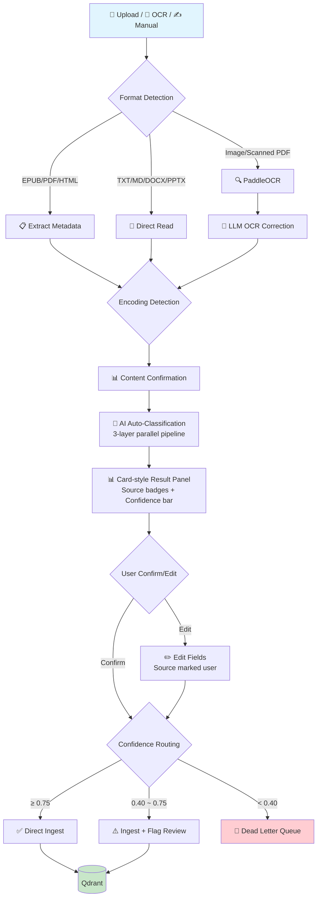
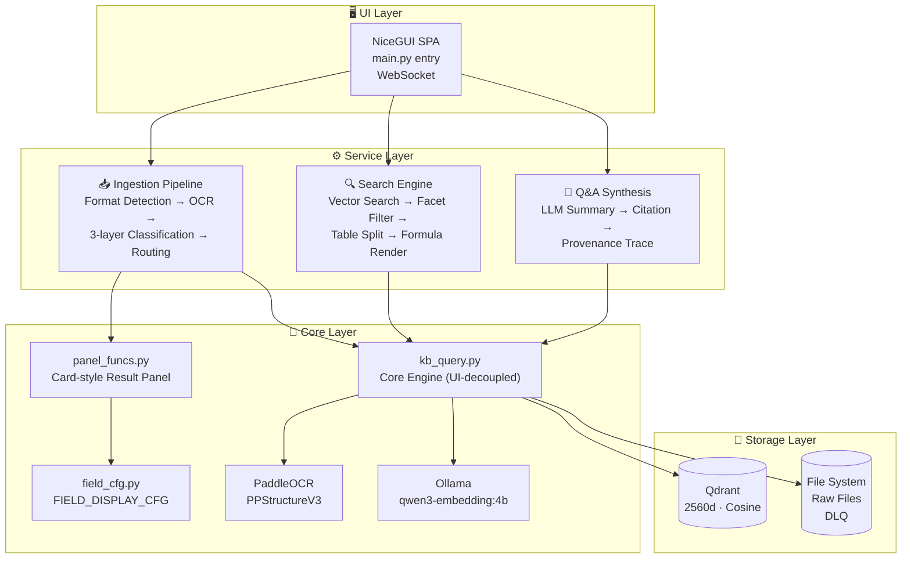

| Version | Status | Codename | Key Deliverables |
|---------|:------:|----------|------------------|
| v0.1.0 | ✅ | Core Engine | CLI vector search + LLM Q&A + OCR + KaTeX |
| v0.2.0 | ✅ | Web UI MVP | NiceGUI 4 pages + collection wizard |
| v0.3.0 | ✅ | Faceted Classification v4.0 | 36-field grouped schema + relations + facet stats |
| v0.4.0 | ✅ | Smart Ingestion | LLM auto-classification + two-phase pipeline |
| v0.4.1 | ✅ | Faceted Classification v5.0 | UDC 9 main classes + NiceGUI SPA |
| v0.4.5 | ✅ | Deep Ingestion | 8-format detection + Dead Letter Queue + confidence routing |
| v0.5.0 | ✅ | L2 Pipeline | auto_classify enhancement + normalize_facet_values |
| v0.5.1 | ✅ | Memory Optimization | get_facet_stats fix |
| v0.6.0 | ✅ | Card-style Result Panel | 3-layer pipeline + config-driven UI + source badges |
| v0.6.1 | 🔮 | Code Quality Refactoring I | main.py page split |
| v0.7.0 | 🔮 | Ingestion Execution Refactoring | Stage 3 + kb_query.py split + unified return format |
| v0.8.0 | 🔮 | Search Refactoring + Knowledge Graph | Search flow refactoring + NetworkX + Plotly |
| v0.9.0 | 🔮 | KB Management Refactoring + Review Queue | Stage 4 + hub/manage optimization |
| v1.0.0 | 🔮 | Production Ready | Stage 5 + code refactoring complete + YAML config |
| v1.1.0 | 🔮 | Search Enhancement | QA auto-generation + graph linkage |
| v1.2.0 | 🔮 | Mobile | WeChat Bot + mobile adaptation |

            paddlepaddle paddleocr "paddlex[ocr]==3.7.0" \
            fpdf2 pillow matplotlib

# 启动
python main.py
# → 浏览器访问 http://127.0.0.1:8080
```

### 使用流程

1. **首次使用** → 自动弹出建库向导 → 选择嵌入模型 → 创建集合
2. **摄入资料** →「文档注入」页面上传文件或 OCR 截图
3. **搜索问答** →「智能检索」页面输入问题，勾选是否启用 AI 问答
4. **管理知识** →「知识中枢」页面查看统计、审核队列、导出数据

> 📘 详细指南：[START.md](START.md)

---

## 👤 适合谁用？

| ✅ 非常适合 | ❌ 不太适合 |
|------------|------------|
| 有中文技术文档/手册积累的人 | 数据量极小（<10 个文件）且不需要搜索 |
| 截图/照片里有大量文字需要检索 | 想要商业化完整 Web UI（我们还在迭代） |
| 关心数据隐私，不想上传云端 | 不想碰任何配置（首次需 2 分钟） |
| 需要精确溯源：答案从哪张图/哪份文档来 | |
| 公式/表格很多的技术文档 | |
| 小说作者（世界观设定管理） | |
| 学术研究者（论文/标准文档管理） | |

---

## ❓ FAQ

**Q：支持英文文档吗？**
A：支持。`qwen3-embedding:4b` 对中英文都有效果。英文场景可换 `nomic-embed-text`。

**Q：能处理多少数据？**
A：理论上无上限，受限于硬件。Qdrant 支持磁盘存储。建议先从小批量（几十个文件）开始。

**Q：和 Obsidian / Notion 有什么区别？**
A：Obsidian 是笔记管理，Notion 是在线协作。Citrinitas 专注**非结构化资料**（截图、扫描件、PDF）的**语义搜索和问答**。

**Q：需要联网吗？**
A：摄入和向量检索不需要联网。仅 LLM 合成回答时需联网（可切换本地 LLM 完全离线）。

**Q：和 RAGFlow / Dify 的定位差异？**
A：RAGFlow/Dify 是面向企业的 RAG 引擎平台，Citrinitas 是面向个人的知识引擎——更轻量（pip 直接装）、更深入（表格行级拆分、分面分类、认知验证层级）、更聚焦个人场景。

---

## 🤝 贡献

欢迎参与！项目处于活跃开发阶段，每一份贡献都能显著影响方向。

- 🐛 **报告 Bug**：[提交 Issue](https://github.com/shiyao222333-afk/citrinitas/issues/new)
- 💡 **功能请求**：[功能请求](https://github.com/shiyao222333-afk/citrinitas/issues/new?template=feature)
- 💻 **代码贡献**：Fork → 分支 → PR

---

## 📄 许可证

[MIT License](LICENSE) — 自由使用、修改和分发。

---

## 🙏 致谢

- [Qdrant](https://github.com/qdrant/qdrant) — 高性能向量数据库
- [Ollama](https://github.com/ollama/ollama) — 本地 LLM 运行环境
- [NiceGUI](https://nicegui.io) — Python SPA 框架
- [PaddleOCR](https://github.com/PaddlePaddle/PaddleOCR) — 中文 OCR 引擎
- [KaTeX](https://github.com/KaTeX/KaTeX) — 公式渲染引擎
- [UDC](https://www.udcsummary.info/) — 国际十进分类法
- Gilda & Lamb (2026) — FPF 第一性原理框架 ([arxiv 2601.21116](https://arxiv.org/abs/2601.21116))

---

<!-- ============================================================ -->
<!--                        EN VERSION                            -->
<!-- ============================================================ -->

<span id="en"></span>

# 🇬🇧 Citrinitas · 熔知 / FusionKnowledge

<p align="center">
  <b>Personal Local Knowledge Engine</b><br>
  Drop in screenshots, manuals, and notes. Ask a question. Get <strong>answers with source citations</strong>.<br>
  All data stays local. Works offline.
</p>

---

## 🤔 Why Citrinitas?

> **"Why not just ask an LLM (GPT/DeepSeek) directly? Why manually input knowledge?"**

The answer in one line:

> **An LLM is a "smart stranger." Citrinitas is a "personal assistant that has read everything you own."**

| Problem | Direct LLM | Citrinitas |
|---------|-----------|---------|
| No access to your private knowledge | ❌ Never read it | ✅ Searches your local files |
| No memory | ❌ Each chat starts fresh | ✅ Gets smarter over time |
| No traceability | ❌ Can't tell where answers come from | ✅ Every answer cites `[refN]` |
| Data privacy | ❌ Uploaded to cloud | ✅ Fully local |

---

## ✨ Core Capabilities & Comparison

> Each ✅ below is annotated with what makes Citrinitas' approach different from competitors. See [docs/schema.md](docs/schema.md) · [PROJECT_PLAN.md](PROJECT_PLAN.md) · [CHANGELOG.md](CHANGELOG.md) for full references.

### 📊 Feature-by-Feature Comparison

| Feature | Citrinitas | RAGFlow<br><sub>37k⭐</sub> | AnythingLLM<br><sub>30k⭐</sub> | Dify<br><sub>60k⭐</sub> | FastGPT<br><sub>20k⭐</sub> |
|---------|:-------:|:-------:|:-------:|:----:|:-------:|
| **📥 Ingestion** | | | | | |
| Chinese OCR | ✅ PPStructureV3<sup>1</sup> | ✅ DeepDoc | ❌ | ❌ | ❌ |
| Formula recognition + rendering | ✅ KaTeX<sup>2</sup> | ✅ | ❌ | ❌ | ❌ |
| LLM auto-classification | ✅ 4-layer<sup>3</sup> | ❌ | ❌ | ❌ | ❌ |
| Multi-format detection | ✅ 8 + encoding check<sup>4</sup> | ✅ 7 parsers | ✅ | ✅ Pipeline | ✅ |
| Confidence routing | ✅ 3-tier<sup>5</sup> | ❌ | ❌ | ❌ | ❌ |
| Dead Letter Queue | ✅ | ❌ | ❌ | ❌ | ❌ |
| **🔍 Search** | | | | | |
| Row-level table splitting | ✅ By row<sup>6</sup> | ❌ | ❌ | ❌ | ❌ |
| Consecutive citations | ✅ | ❌ | ❌ | ❌ | ❌ |
| Clickable provenance | ✅ | ✅ | ✅ | ✅ | ✅ |
| **🗂️ Knowledge Org** | | | | | |
| Faceted classification | ✅ 4D (UDC+FPF)<sup>7</sup> | ❌ Flat tags | ❌ Workspaces | ❌ Metadata | ❌ Datasets |
| Epistemic verification | ✅ L0–L2 | ❌ | ❌ | ❌ | ❌ |
| Universal relations | ✅ 8 types<sup>8</sup> | ❌ | ❌ | ❌ | ❌ |
| **🏗️ Architecture** | | | | | |
| Fully local | ✅ | ✅ | ✅ | ✅ | ✅ |
| Deployment | pip install | Docker | Desktop/Docker | Docker+DBS | Docker+DBS |
| License | MIT | Apache 2.0 | MIT | Apache 2.0 | MIT |

> <sup>1</sup> **OCR**: RAGFlow's DeepDoc (ONNX+pdfplumber) is equally strong but targets enterprise PDF batch processing; Citrinitas focuses on personal mixed media (screenshots/scans/EPUBs) with an OCR→LLM correction→ingestion **automated loop**. FastGPT/Dify/AnythingLLM have no built-in OCR.  
> <sup>2</sup> **Formulas**: Citrinitas renders formulas as scalable SVG via PPStructureV3→LaTeX→KaTeX, embedded in search results. RAGFlow supports formula recognition but its dedicated rendering pipeline is unconfirmed. Others treat formulas as plain text.  
> <sup>3</sup> **Auto-classification**: Citrinitas uses a 4-layer LLM pipeline (template→metadata→keyword→LLM inference) to auto-label facet fields; users only confirm. No competitor has this — RAGFlow chunks carry only coordinate tags, Dify requires manual pipeline configuration, FastGPT/AnythingLLM rely on folder organization. [→ FPF arxiv 2601.21116](docs/schema.md)  
> <sup>4</sup> **Format detection**: Citrinitas goes beyond format ID to auto-extract metadata (EPUB Dublin Core / PDF Document Info / HTML meta) + chardet UTF-8→GBK encoding chain. RAGFlow's 7-parser matrix is more flexible but doesn't extract metadata automatically.  
> <sup>5</sup> **Confidence routing**: Unique 3-tier routing (≥0.8 direct / 0.5-0.8 flagged / <0.5 quarantined) with Dead Letter Queue. All competitors use all-or-nothing — parse failures are silently discarded. This is Citrinitas' core safety design for personal knowledge management. [→ PROJECT_PLAN.md](PROJECT_PLAN.md)  
> <sup>6</sup> **Table splitting**: Citrinitas splits tables by row as independent search units with header context preserved. RAGFlow chunks by token count (default 512), Dify uses parent-child mode — neither does row-level structural indexing.  
> <sup>7</sup> **Faceted classification**: Based on UDC (Universal Decimal Classification) + FPF epistemic hierarchy. 4 dimensions (type × domain × temporality × verification) with Payload Indexes. Competitors use folder/label 2D organization — none distinguishes "math theorem (evergreen/corroborated)" from "industry news (transient/unverified)." [→ UDC](https://www.udcsummary.info/)  
> <sup>8</sup> **Relations**: Citrinitas supports 8 relation types (similar/references/contradicts/derived_from/merged_into/supersedes/depends_on) building citation and contradiction chains. No competitor offers inter-entry relation management. [→ docs/schema.md](docs/schema.md)

### ⚖️ Strengths & Trade-offs

To be fair, competitors beat us in these areas:

| Competitor | Key Strengths | Citrinitas Status |
|------------|--------------|----------------|
| **RAGFlow** | Knowledge graph multi-hop reasoning, Agent integration, 7-parser matrix, enterprise multi-tenancy | None supported — personal use only |
| **Dify** | Full AI app platform (visual workflow + plugin marketplace + observability), 60k⭐ community | No workflow/plugins/monitoring, community just starting |
| **FastGPT** | QA auto-generation (docs→Q&A pairs), 500K+ validated users | Don't have this ingestion mode |
| **AnythingLLM** | Electron desktop app, plug-and-play multi-model | No desktop app |

Citrinitas is not trying to become another RAGFlow or Dify. Our trade-offs are deliberate:

| We DON'T do | We DO |
|-------------|-------|
| Enterprise multi-tenancy / visual workflows / Agents / plugins | **Personal knowledge engine**: deep understanding + structured cognition + precise provenance |
| Desktop app / multi-platform | **Lightweight**: single `pip install` |

> 💡 Need an enterprise RAG platform or general AI app builder → RAGFlow / Dify. Need **deep personal knowledge understanding** and willing to grow with the project → Citrinitas is a better fit.

---

## 🔄 Workflow

### Ingestion Pipeline



### Search & Q&A


---

## 🏗️ Architecture



**Tech Stack:**

| Layer | Technology | Notes |
|-------|-----------|-------|
| Vector DB | [Qdrant](https://github.com/qdrant/qdrant) | 2560d, Cosine, single collection `citrinitas_v1` |
| Embeddings | [Ollama](https://github.com/ollama/ollama) + `qwen3-embedding:4b` | Local inference, bilingual |
| OCR | [PaddleOCR](https://github.com/PaddlePaddle/PaddleOCR) / PPStructureV3 | Chinese-optimized, table + formula recognition |
| LLM | OpenAI-compatible API (default DeepSeek) | Swappable (Qwen, local models) |
| Formula | [KaTeX](https://github.com/KaTeX/KaTeX) | Server-side rendering, vector output |
| Web UI | [NiceGUI](https://nicegui.io) 3.13 | SPA, FastAPI + Vue + Quasar + WebSocket |
| Encoding | [chardet](https://github.com/chardet/chardet) | UTF-8 → GBK → latin-1 fallback chain |

---

\#\#\ ✨\ v0\.6\.0\ Core\ Features\
\
>\ Card\-style\ result\ panel\ refactor\ —\ config\-driven\ UI,\ traceable\ provenance\.\
\
\#\#\#\ 📊\ Card\-style\ Result\ Panel\
\
After\ AI\ analysis,\ results\ display\ as\ \*\*interactive\ cards\*\*\ instead\ of\ dropdown\ menus:\
\
\-\ \*\*5\ groups,\ 19\ fields\*\*:\ Faceted\(4\)\ /\ Content\(4\)\ /\ Knowledge\(6\)\ /\ Source\(3\)\ /\ Timestamp\(2\)\
\-\ \*\*Source\ badges\*\*:\ 📎\(file\)\ 📐\(rule\)\ 🤖\(llm\)\ 👤\(user\)\ ⚙️\(default\)\ next\ to\ each\ field\
\-\ \*\*Overall\ confidence\ bar\*\*:\ top\ of\ panel,\ with\ source\ statistics\
\-\ \*\*Click\ to\ edit\*\*:\ click\ any\ field\ card\ →\ edit\ dialog;\ after\ edit,\ source\ auto\-marked\ `user`\
\-\ \*\*Advanced\ options\ folded\*\*:\ `⚙️\ Advanced`\ expansion\ button,\ collapsed\ by\ default\
\
\#\#\#\ 🧠\ 3\-Layer\ Parallel\ Classification\ Pipeline\
\
```\
Layer\ 1\ \(parallel\):\ \ file\ metadata\ extract\ \ \+\ \ rule\ engine\ match\ \ \ \ \ →\ \ known\ values\
Layer\ 2\ \(merge\):\ \ \ \ \ priority\ merge\(file>rule\)\ \ \+\ \ LLM\ fills\ gaps\ \ →\ \ full\ annotation\
Layer\ 3\ \(confidence\):\ field\ weight\ ×\ source\ confidence\ calc\ \ \ \ \ \ →\ \ reproducible\ score\
```\
\
\#\#\#\ 📐\ Config\-Driven\ Rendering\
\
`field_cfg\.py`\ defines\ `FIELD_DISPLAY_CFG`\ config\ table;\ `panel_funcs\.py`\ renders\ UI\ from\ config\.\ \*\*Adding\ a\ new\ field\ requires\ only\ config\ change,\ no\ code\ change\.\*\*\
\
\-\-\-\
\
\#\#\ 🗺️\ Roadmap\
\
|\ Version\ |\ Status\ |\ Codename\ |\ Key\ Deliverables\ |
|---------|:------:|----------|------------------|
| v0.1.0 | ✅ | Core Engine | CLI vector search + LLM Q&A + OCR + KaTeX + table splitting |
| v0.2.0 | ✅ | Web UI MVP | 4 pages (ingest/search/manage/config) + collection wizard |
| v0.3.0 | ✅ | Faceted Classification v4.0 | 36-field grouped schema + relations + facet stats dashboard |
| v0.4.0 | ✅ | Smart Ingestion | LLM auto-classification + two-phase ingestion pipeline |
| v0.4.1 | ✅ | Faceted Classification v5.0 | UDC 9 main classes + NiceGUI SPA migration |
| v0.4.5 | ✅ | Deep Ingestion | 8-format detection + Dead Letter Queue + confidence routing |
| v0.5.0 | ✅ | L2 Pipeline | auto_classify enhancement + normalize_facet_values |
| v0.6.0 | ✅ | Card-style Result Panel | 3-layer parallel classification + config-driven UI + source badges + confidence bar |
| v0.7.0 | 🔮 | Page Modularization | main.py page split (ingest/search/hub/manage/config) |
| v1.0.0 | 🔮 | Production Ready | Mobile adaptation + WeChat Bot + knowledge graph |

> Full roadmap: [PROJECT_PLAN.md](PROJECT_PLAN.md)

---

## ⚙️ Setup

```bash
# Prerequisites
# Python >= 3.13, Ollama from https://ollama.com
ollama pull qwen3-embedding:4b

# Install & Run
pip install nicegui requests qdrant-client \
            paddlepaddle paddleocr "paddlex[ocr]==3.7.0" \
            fpdf2 pillow matplotlib
python main.py
# → http://localhost:8080
```

**Usage:**
1. **First launch** → Collection wizard pops up → select embedding model → create collection
2. **Ingest** → "Document Ingestion" page → upload files or OCR screenshots
3. **Search** → "Smart Search" page → type query, toggle AI synthesis
4. **Manage** → "Knowledge Hub" page → stats, review queue, export

> 📘 Detailed guide: [START.md](START.md)

---

## 👤 Who Is This For?

| ✅ Great fit | ❌ Not a great fit |
|-------------|-------------------|
| People with Chinese technical docs/manuals | Tiny datasets (<10 files) with no search needs |
| Lots of text trapped in screenshots/photos | Want a polished commercial Web UI (we're iterating) |
| Privacy-conscious, don't want cloud upload | Don't want any config (first setup takes 2 min) |
| Need precise provenance: which doc/page did this come from? | |
| Technical docs heavy on formulas and tables | |
| Fiction authors (worldbuilding knowledge management) | |
| Academic researchers (paper/standard management) | |

---

## ❓ FAQ

**Q: Does it support English documents?**
A: Yes. `qwen3-embedding:4b` works well for both Chinese and English. For English-only, switch to `nomic-embed-text`.

**Q: How much data can it handle?**
A: Theoretically unlimited, bounded by hardware. Qdrant supports disk storage. Start with small batches (a few dozen files).

**Q: How is it different from Obsidian / Notion?**
A: Obsidian is note management; Notion is online collaboration. Citrinitas focuses on **semantic search and Q&A over unstructured materials** (screenshots, scans, PDFs).

**Q: Does it need internet?**
A: Ingestion and vector search work offline. Only LLM synthesis needs internet (switch to a local LLM for full offline operation).

**Q: How does it differ from RAGFlow / Dify?**
A: RAGFlow/Dify are enterprise RAG platforms. Citrinitas is a personal knowledge engine — lighter (pip install), deeper (row-level table splitting, faceted classification, epistemic verification levels), and focused on individual use cases.

---

## 🤝 Contributing

Contributions welcome! The project is in active development — every contribution shapes its direction.

- 🐛 **Bug Report**: [Open an Issue](https://github.com/shiyao222333-afk/citrinitas/issues/new)
- 💡 **Feature Request**: [Feature Request](https://github.com/shiyao222333-afk/citrinitas/issues/new?template=feature)
- 💻 **Code**: Fork → Branch → PR

---

## 📄 License

[MIT License](LICENSE) — Free to use, modify, and distribute.

---

## 🙏 Acknowledgments

- [Qdrant](https://github.com/qdrant/qdrant) — High-performance vector database
- [Ollama](https://github.com/ollama/ollama) — Local LLM runtime
- [NiceGUI](https://nicegui.io) — Python SPA framework
- [PaddleOCR](https://github.com/PaddlePaddle/PaddleOCR) — Chinese OCR engine
- [KaTeX](https://github.com/KaTeX/KaTeX) — Formula rendering engine
- [UDC](https://www.udcsummary.info/) — Universal Decimal Classification
- Gilda & Lamb (2026) — FPF First-Principles Framework ([arxiv 2601.21116](https://arxiv.org/abs/2601.21116))

---

<p align="center">
  <a href="#cn">🇨🇳 Back to 中文</a> &nbsp;|&nbsp;
  <a href="#en">🇬🇧 Back to Top</a>
</p>

<p align="center">
  ⭐ If this direction resonates with you, please give it a Star!<br>
  🗂️ Turn your accumulated knowledge into real assets.
</p>

<p align="center">
  
</p>

