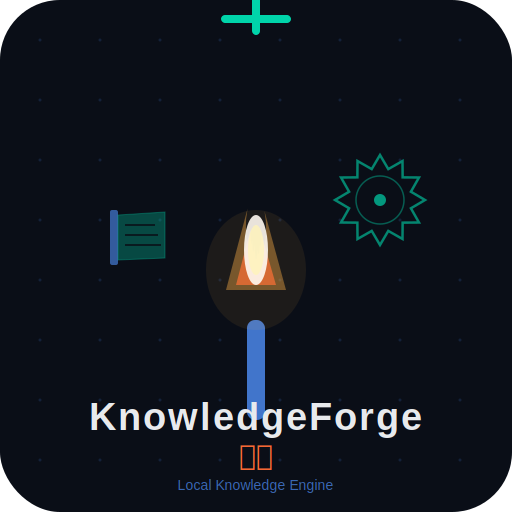
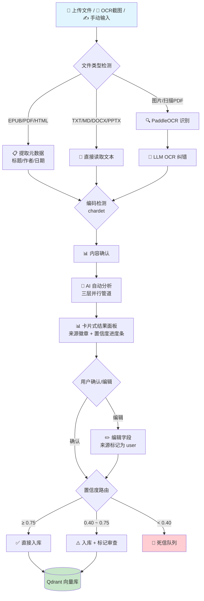
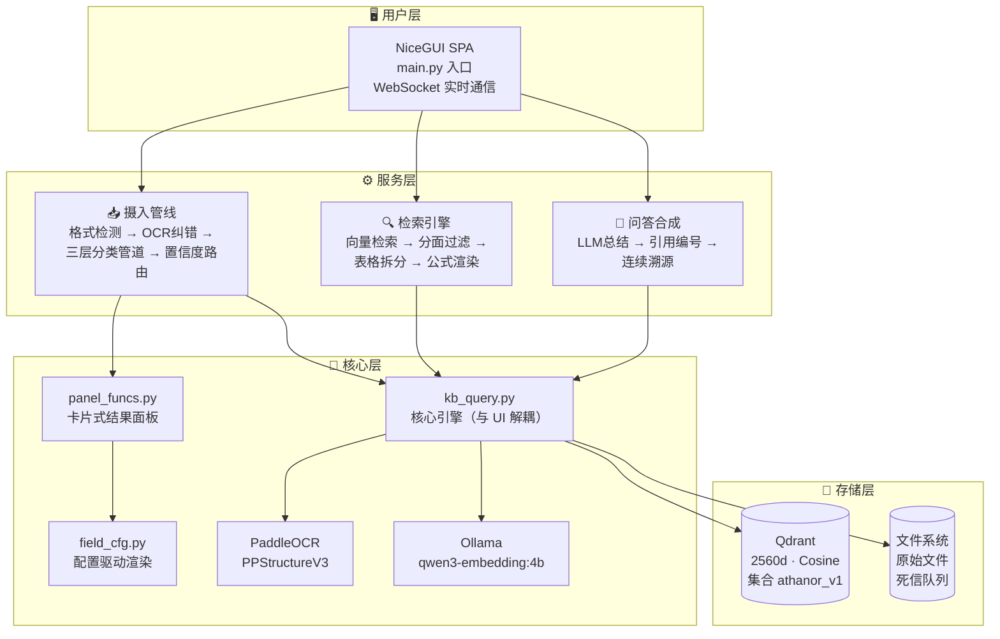
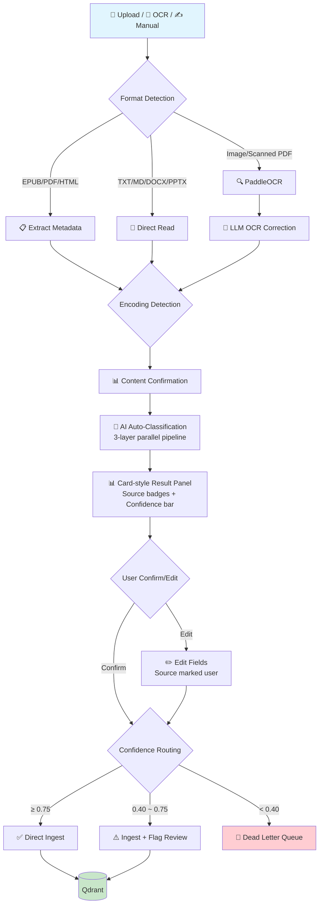
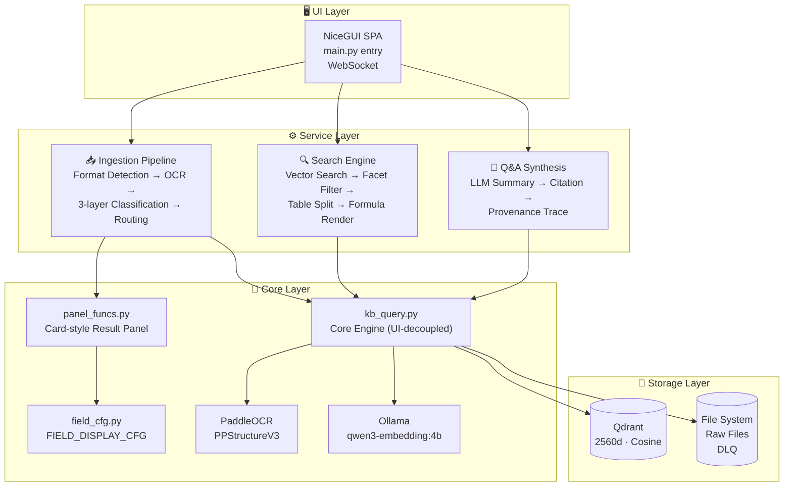

<p align="center">
  
</p>

<h1 align="center">Citrinitas · 熔知 / FusionKnowledge</h1>

<p align="center">
  <b>个人本地知识引擎</b><br>
  把截图、手册、笔记丢进去，问一个问题，直接得到<strong>带来源引用的答案</strong>。<br>
  数据全在本地，不联网也能用。
</p>

<p align="center">
  <a href="https://github.com/shiyao222333-afk/citrinitas"></a>
  <a href="https://github.com/shiyao222333-afk/citrinitas/blob/main/LICENSE"></a>
  
  <a href="https://github.com/shiyao222333-afk/citrinitas/stargazers"></a>
</p>

<p align="center">
  <b>🌐 Language:</b> &nbsp;
  <a href="#cn">🇨🇳 中文</a> &nbsp;|&nbsp;
  <a href="#en">🇬🇧 English</a>
</p>

<p align="center">
  <a href="#-为什么需要-citrinitas"><b>🤔 为什么需要</b></a> ·
  <a href="#-核心能力--竞品对比"><b>✨ 核心能力 & 竞品对比</b></a> ·
  <a href="#-操作流程"><b>🔄 操作流程</b></a> ·
  <a href="#-架构概览"><b>🏗️ 架构概览</b></a> ·
  <a href="#-路线图"><b>🗺️ 路线图</b></a> ·
  <a href="#-快速开始"><b>⚡ 快速开始</b></a> ·
  <a href="https://github.com/shiyao222333-afk/citrinitas/issues"><b>🐛 提 Issue</b></a>
</p>

---

<!-- ============================================================ -->
<!--                        CN VERSION                            -->
<!-- ============================================================ -->

<span id="cn"></span>

## 🤔 为什么需要 Citrinitas？

> **"有问题直接问 LLM（GPT/DeepSeek）不就行了，为什么要手动输入知识？"**

答案一句话：

> **LLM 是「聪明的外人」，Citrinitas 是「读过你所有资料的私人助理」。**

| 问题 | 直接问 LLM | 用 Citrinitas |
|------|-----------|-------------------|
| 没有你的私有知识 | ❌ 它没读过 | ✅ 直接搜你本地资料 |
| 没有记忆 | ❌ 每次对话都是新的 | ✅ 越用越强 |
| 无法溯源 | ❌ 答案不知道从哪来 | ✅ 每个答案带 `[引用N]` |
| 数据隐私 | ❌ 上传云端 | ✅ 全本地运行 |

---

## ✨ 核心能力 & 竞品对比

> 下表中每个 ✅ 后面标注了与竞品的关键差异。完整依据详见 [docs/schema.md](docs/schema.md) · [PROJECT_PLAN.md](PROJECT_PLAN.md) · [CHANGELOG.md](CHANGELOG.md).

### 📊 功能逐一对比

| 功能 | Citrinitas | RAGFlow<br><sub>84k⭐</sub> | AnythingLLM<br><sub>62k⭐</sub> | Dify<br><sub>147k⭐</sub> | FastGPT<br><sub>29k⭐</sub> |
|------|:-------:|:-------:|:-------:|:----:|:-------:|
| **📥 摄入** | | | | | |
| 中文 OCR | ✅ PPStructureV3<sup>1</sup> | ✅ DeepDoc | ❌ | ❌ | ❌ |
| 公式识别+渲染 | ✅ KaTeX<sup>2</sup> | ✅ | ❌ | ❌ | ❌ |
| LLM 自动分类 | ✅ 四层推断<sup>3</sup> | ❌ | ❌ | ❌ | ❌ |
| 多格式检测 | ✅ 8种+编码自检<sup>4</sup> | ✅ 7种解析器 | ✅ | ✅ 流水线 | ✅ |
| 置信度路由 | ✅ 三档<sup>5</sup> | ❌ | ❌ | ❌ | ❌ |
| 死信队列 | ✅ | ❌ | ❌ | ❌ | ❌ |
| **🔍 搜索** | | | | | |
| 表格行级拆分 | ✅ 按行索引<sup>6</sup> | ❌ | ❌ | ❌ | ❌ |
| 连续引用编号 | ✅ | ❌ | ❌ | ❌ | ❌ |
| 引用点击溯源 | ✅ | ✅ | ✅ | ✅ | ✅ |
| **🗂️ 知识组织** | | | | | |
| 分面分类 | ✅ 4维 (UDC+FPF)<sup>7</sup> | ❌ 扁平标签 | ❌ 工作区 | ❌ 元数据字段 | ❌ 数据集 |
| 认知验证层级 | ✅ L0-L2 | ❌ | ❌ | ❌ | ❌ |
| 通用关系字段 | ✅ 8种关系<sup>8</sup> | ❌ | ❌ | ❌ | ❌ |
| **🏗️ 架构** | | | | | |
| 本地运行 | ✅ | ✅ | ✅ | ✅ | ✅ |
| 部署方式 | install.ps1 | Docker | Desktop/Docker | Docker+DBS | Docker+DBS |
| 开源协议 | MIT | Apache 2.0 | MIT | Apache 2.0 | MIT |

> <sup>1</sup> **OCR**：RAGFlow 用 DeepDoc 同等强大，但面向企业 PDF 批处理；Citrinitas 聚焦个人混合素材的 OCR→LLM纠错→摄入自动化闭环。FastGPT/Dify/AnythingLLM 无内置 OCR。  
> <sup>2</sup> **公式**：Citrinitas 通过 PPStructureV3→LaTeX→KaTeX 将公式渲染为可缩放 SVG 嵌入搜索结果。RAGFlow 支持公式识别但渲染链路未确认。其余竞品不区分公式和普通文本。  
> <sup>3</sup> **自动分类**：Citrinitas 用 LLM 四层管道自动标注分面字段，用户只需确认。所有竞品均无此能力。[→ FPF arxiv 2601.21116](docs/schema.md)  
> <sup>4</sup> **格式检测**：除识别 8 种格式外还自动提取元数据 + chardet 编码兜底。RAGFlow 解析器矩阵更强，但不提取元数据。  
> <sup>5</sup> **置信度路由**：独有三档路由（≥0.8 直入 / 0.5-0.8 标记 / <0.5 隔离）+ 死信队列。竞品均为全有或全无。[→ PROJECT_PLAN.md](PROJECT_PLAN.md)  
> <sup>6</sup> **表格拆分**：按行切分表格为独立检索单元，每行保留表头上下文。竞品按 token/分块切分，不做行级索引。  
> <sup>7</sup> **分面分类**：基于 UDC 国际十进分类法 + FPF 认知层级，4 维标注，支持组合过滤。[→ UDC](https://www.udcsummary.info/)  
> <sup>8</sup> **关系字段**：支持 8 种关系类型建立引用链和矛盾链。所有竞品均无条目间关系管理。[→ docs/schema.md](docs/schema.md)

### ⚖️ 各有千秋与定位取舍

| 竞品 | 核心优势 | Citrinitas 的状态 |
|------|---------|---------------|
| **RAGFlow** | Agentic RAG、知识图谱多跳推理、7 种解析器矩阵、企业多租户 | 均不支持，定位个人使用 |
| **Dify** | 完整 AI 应用平台（可视化工作流 + 插件市场 + MCP + Agentic Workflow）、147k⭐ 社区 | 无工作流/插件/监控，社区刚起步 |
| **FastGPT** | QA 自动生成 + Agent + MCP + Workflow、50 万+ 用户 | 无此摄入方式 |
| **AnythingLLM** | Electron 桌面端、Agent Harness + MCP、即插即用多模型 | 无桌面端 |

| 我们不做 | 我们在做 |
|----------|---------|
| 企业多租户 / 可视化工作流 / Agent / 插件市场 | **个人知识引擎**：深度理解 + 结构化认知 + 精确溯源 |
| 桌面应用 / 多端适配 | **轻量部署**：一条 `install.ps1` |

> 💡 需要企业级 RAG 平台或通用 AI 应用构建器 → RAGFlow / Dify。需要**个人知识深度理解**且愿意和项目一起成长 → Citrinitas 的方向更对路。

---

## 🔄 操作流程

### 摄入管线



### 搜索问答


---

## 🏗️ 架构概览



**技术栈一览：**

| 层 | 技术 | 说明 |
|----|------|------|
| 向量数据库 | [Qdrant](https://github.com/qdrant/qdrant) | 2560d, Cosine, 单集合 `athanor_v1` |
| 嵌入模型 | [Ollama](https://github.com/ollama/ollama) + `qwen3-embedding:4b` | 本地推理，中英文兼顾 |
| OCR 引擎 | [PaddleOCR](https://github.com/PaddlePaddle/PaddleOCR) / PPStructureV3 | 中文优化，表格+公式识别 |
| LLM 合成 | OpenAI 兼容 API（默认 DeepSeek） | 可切换通义千问/本地模型 |
| 公式渲染 | [KaTeX](https://github.com/KaTeX/KaTeX) | 服务端渲染，矢量输出 |
| Web UI | [NiceGUI](https://nicegui.io) 3.13 | SPA, FastAPI + Vue + Quasar + WebSocket |
| 编码检测 | [chardet](https://github.com/chardet/chardet) | UTF-8 → GBK → latin-1 兜底链 |

---

## ✨ v1.0 核心特性

> 生产就绪 — 一键部署，100+ Bug 修复，全流程打磨。

### 🚀 一键部署

```bash
# Windows 用户：双击两个文件
install.ps1   # 自动检测 Python/Ollama，安装依赖，拉取模型
run.bat        # 自动启动 Qdrant，打开浏览器
```

不需要 Docker，不需要手动配置环境变量。`run.bat` 启动后 Web UI 自动在浏览器打开，含启动成功横幅。

### 📊 卡片式结果面板

- **5 组 19 字段**：分面分类 / 内容标识 / 知识属性 / 来源信息 / 时间戳
- **来源徽章**：每个字段标注 📎(文件提取) 📐(规则匹配) 🤖(LLM) 👤(用户)
- **置信度进度条**：面板顶部综合置信度 + 来源统计，一眼判断可信度
- **点击编辑**：点任意字段弹出编辑框，修改后来源自动标记为用户修正

### 🧠 三层并行分类管道

```
Layer 1 (并行):  文件元数据提取  +  规则引擎匹配     →  已有值
Layer 2 (合并):   优先级合并(file>rule)  +  LLM 填补缺口  →  完整标注
Layer 3 (置信度): 按字段权重 × 来源置信度计算            →  可复现评分
```

### 👁️ Watch Folder 自动摄入

拖文件到 `watch/` 文件夹，自动检测格式（8 种）、自动分类入库。失败文件进入死信队列，不静默丢失。

### 🔍 混合搜索 + RRF 重排

向量搜索 + 关键词搜索并行执行，RRF 融合排序。支持分面过滤。

### 🗂️ 知识图谱 & 审核队列

8 种关系类型的知识图谱可视化 + 待审核/死信队列集中管理。

---

## 🗺️ 路线图

| Version | Status | Codename | Key Deliverables |
|---------|:------:|----------|------------------|
| v0.1.0 | ✅ | Core Engine | CLI vector search + LLM Q&A + OCR + KaTeX |
| v0.2.0 | ✅ | Web UI MVP | NiceGUI 4 pages + collection wizard |
| v0.3.0 | ✅ | Faceted Classification v4.0 | 36-field grouped schema + relations + facet stats |
| v0.4.0 | ✅ | Smart Ingestion | LLM auto-classification + two-phase pipeline |
| v0.4.1 | ✅ | Faceted Classification v5.0 | UDC 9 main classes + NiceGUI SPA |
| v0.4.5 | ✅ | Deep Ingestion | 8-format detection + Dead Letter Queue + confidence routing |
| v0.5.0 | ✅ | L2 Pipeline | auto_classify enhancement + normalize_facet_values |
| v0.5.1 | ✅ | Memory Optimization | get_facet_stats fix |
| v0.6.0 | ✅ | Card-style Result Panel | 3-layer pipeline + config-driven UI + source badges |
| v0.6.1 | ✅ | Code Quality Refactoring I | main.py page split |
| v0.7.0 | ✅ | Ingestion Execution Refactoring | Stage 3 + kb_query.py split + unified return format |
| v0.8.0 | ✅ | Search Refactoring + Knowledge Graph | Hybrid search + RRF rerank + review/dead-letter queue |
| v0.9.0 | ✅ | KB Management Refactoring + Review Queue | Dashboard redesign + doc browser + batch upload + activity log |
| v1.0.0 | ✅ | Production Ready | install.ps1 + run.bat complete + watcher v2 + 100+ bug fixes |
| v1.0.1 | ✅ | Code Quality Refactoring II | Dead code removal + 3x large file splitting + 2x bug fixes |
| v1.1.0 | 🔮 | 错误日志规范 (Error Logging) | 统一日志 + 错误码 + 日志查看器 |
| v1.2.0 | 🔮 | 闪念笔记 (Fleeting Notes) | fleeting_note 类型 + 快速捕获 + 标签支持 |
| v1.3.0 | 🔮 | 项目间通信API | Nigredo ↔ Citrinitas ↔ Rubedo 标准接口 |
| v1.4.0 | 🔮 | 知识关系网 | NetworkX 知识图谱 + 8种关系类型可视化 |
| v1.5.0 | 🔮 | 摄入增强 | 网页 URL 直接摄入 + 多语言文档自动翻译入库 |
| v1.6.0 | 🔮 | LLM智能选择 | 按任务复杂度自动选择模型 |
| v1.7.0 | 🔮 | 性能优化 | 后台运行 + 内存优化 + 搜索缓存 + 批量操作 + 冷启动加速 |
| v1.8.0 | 🔮 | 知识保鲜 | 过期检测 + 更新提醒 + 自动归档 |
| v1.9.0 | 🔮 | UI美化 | 自定义主题 + 深色模式 + 动画 |
| v1.10.0 | 🔮 | Git说明页面 | 完整文档体系 + 贡献指南 + API文档 |

---

## 🚀 快速开始

```bash
# 前置条件
# Python >= 3.13, Ollama https://ollama.com
ollama pull qwen3-embedding:4b

# 一键部署
powershell -File install.ps1

# 启动
run.bat
# → 浏览器访问 http://127.0.0.1:8080
```

### 使用流程

1. **首次使用** → 自动弹出建库向导 → 选择嵌入模型 → 创建集合
2. **摄入资料** →「文档注入」页面上传文件或 OCR 截图
3. **搜索问答** →「智能检索」页面输入问题，勾选是否启用 AI 问答
4. **管理知识** →「知识中枢」页面查看统计、审核队列、导出数据

> 📘 详细指南：[START.md](START.md)

---

## 👤 适合谁用？

| ✅ 非常适合 | ❌ 不太适合 |
|------------|------------|
| 有中文技术文档/手册积累的人 | 数据量极小（<10 个文件）且不需要搜索 |
| 截图/照片里有大量文字需要检索 | 想要商业化完整 Web UI（我们还在迭代） |
| 关心数据隐私，不想上传云端 | 不想碰任何配置（首次需 2 分钟） |
| 需要精确溯源：答案从哪张图/哪份文档来 | |
| 公式/表格很多的技术文档 | |
| 小说作者（世界观设定管理） | |
| 学术研究者（论文/标准文档管理） | |

---

## ❓ FAQ

**Q：支持英文文档吗？**
A：支持。`qwen3-embedding:4b` 对中英文都有效果。英文场景可换 `nomic-embed-text`。

**Q：能处理多少数据？**
A：理论上无上限，受限于硬件。Qdrant 支持磁盘存储。建议先从小批量（几十个文件）开始。

**Q：和 Obsidian / Notion 有什么区别？**
A：Obsidian 是笔记管理，Notion 是在线协作。Citrinitas 专注**非结构化资料**（截图、扫描件、PDF）的**语义搜索和问答**。

**Q：需要联网吗？**
A：摄入和向量检索不需要联网。仅 LLM 合成回答时需联网（可切换本地 LLM 完全离线）。

**Q：和 RAGFlow / Dify 的定位差异？**
A：RAGFlow/Dify 是面向企业的 RAG 引擎平台，Citrinitas 是面向个人的知识引擎——更轻量（install.ps1 一键部署）、更深入（表格行级拆分、分面分类、认知验证层级）、更聚焦个人场景。

---

## 🤝 贡献

欢迎参与！项目处于活跃开发阶段，每一份贡献都能显著影响方向。

- 🐛 **报告 Bug**：[提交 Issue](https://github.com/shiyao222333-afk/citrinitas/issues/new)
- 💡 **功能请求**：[功能请求](https://github.com/shiyao222333-afk/citrinitas/issues/new?template=feature)
- 💻 **代码贡献**：Fork → 分支 → PR

---

## 📄 许可证

[MIT License](LICENSE) — 自由使用、修改和分发。

---

## 🙏 致谢

- [Qdrant](https://github.com/qdrant/qdrant) — 高性能向量数据库
- [Ollama](https://github.com/ollama/ollama) — 本地 LLM 运行环境
- [NiceGUI](https://nicegui.io) — Python SPA 框架
- [PaddleOCR](https://github.com/PaddlePaddle/PaddleOCR) — 中文 OCR 引擎
- [KaTeX](https://github.com/KaTeX/KaTeX) — 公式渲染引擎
- [UDC](https://www.udcsummary.info/) — 国际十进分类法
- Gilda & Lamb (2026) — FPF 第一性原理框架 ([arxiv 2601.21116](https://arxiv.org/abs/2601.21116))

---

<!-- ============================================================ -->
<!--                        EN VERSION                            -->
<!-- ============================================================ -->

<span id="en"></span>

# 🇬🇧 Citrinitas · 熔知 / FusionKnowledge

<p align="center">
  <b>Personal Local Knowledge Engine</b><br>
  Drop in screenshots, manuals, and notes. Ask a question. Get <strong>answers with source citations</strong>.<br>
  All data stays local. Works offline.
</p>

---

## 🤔 Why Citrinitas?

> **"Why not just ask an LLM (GPT/DeepSeek) directly? Why manually input knowledge?"**

The answer in one line:

> **An LLM is a "smart stranger." Citrinitas is a "personal assistant that has read everything you own."**

| Problem | Direct LLM | Citrinitas |
|---------|-----------|---------|
| No access to your private knowledge | ❌ Never read it | ✅ Searches your local files |
| No memory | ❌ Each chat starts fresh | ✅ Gets smarter over time |
| No traceability | ❌ Can't tell where answers come from | ✅ Every answer cites `[refN]` |
| Data privacy | ❌ Uploaded to cloud | ✅ Fully local |

---

## ✨ Core Capabilities & Comparison

> Each ✅ below is annotated with what makes Citrinitas' approach different from competitors. See [docs/schema.md](docs/schema.md) · [PROJECT_PLAN.md](PROJECT_PLAN.md) · [CHANGELOG.md](CHANGELOG.md) for full references.

### 📊 Feature-by-Feature Comparison

| Feature | Citrinitas | RAGFlow<br><sub>84k⭐</sub> | AnythingLLM<br><sub>62k⭐</sub> | Dify<br><sub>147k⭐</sub> | FastGPT<br><sub>29k⭐</sub> |
|---------|:-------:|:-------:|:-------:|:----:|:-------:|
| **📥 Ingestion** | | | | | |
| Chinese OCR | ✅ PPStructureV3<sup>1</sup> | ✅ DeepDoc | ❌ | ❌ | ❌ |
| Formula recognition + rendering | ✅ KaTeX<sup>2</sup> | ✅ | ❌ | ❌ | ❌ |
| LLM auto-classification | ✅ 4-layer<sup>3</sup> | ❌ | ❌ | ❌ | ❌ |
| Multi-format detection | ✅ 8 + encoding check<sup>4</sup> | ✅ 7 parsers | ✅ | ✅ Pipeline | ✅ |
| Confidence routing | ✅ 3-tier<sup>5</sup> | ❌ | ❌ | ❌ | ❌ |
| Dead Letter Queue | ✅ | ❌ | ❌ | ❌ | ❌ |
| **🔍 Search** | | | | | |
| Row-level table splitting | ✅ By row<sup>6</sup> | ❌ | ❌ | ❌ | ❌ |
| Consecutive citations | ✅ | ❌ | ❌ | ❌ | ❌ |
| Clickable provenance | ✅ | ✅ | ✅ | ✅ | ✅ |
| **🗂️ Knowledge Org** | | | | | |
| Faceted classification | ✅ 4D (UDC+FPF)<sup>7</sup> | ❌ Flat tags | ❌ Workspaces | ❌ Metadata | ❌ Datasets |
| Epistemic verification | ✅ L0–L2 | ❌ | ❌ | ❌ | ❌ |
| Universal relations | ✅ 8 types<sup>8</sup> | ❌ | ❌ | ❌ | ❌ |
| **🏗️ Architecture** | | | | | |
| Fully local | ✅ | ✅ | ✅ | ✅ | ✅ |
| Deployment | install.ps1 | Docker | Desktop/Docker | Docker+DBS | Docker+DBS |
| License | MIT | Apache 2.0 | MIT | Apache 2.0 | MIT |

> <sup>1</sup> **OCR**: RAGFlow's DeepDoc (ONNX+pdfplumber) is equally strong but targets enterprise PDF batch processing; Citrinitas focuses on personal mixed media (screenshots/scans/EPUBs) with an OCR→LLM correction→ingestion **automated loop**. FastGPT/Dify/AnythingLLM have no built-in OCR.  
> <sup>2</sup> **Formulas**: Citrinitas renders formulas as scalable SVG via PPStructureV3→LaTeX→KaTeX, embedded in search results. RAGFlow supports formula recognition but its dedicated rendering pipeline is unconfirmed. Others treat formulas as plain text.  
> <sup>3</sup> **Auto-classification**: Citrinitas uses a 4-layer LLM pipeline (template→metadata→keyword→LLM inference) to auto-label facet fields; users only confirm. No competitor has this — RAGFlow chunks carry only coordinate tags, Dify requires manual pipeline configuration, FastGPT/AnythingLLM rely on folder organization. [→ FPF arxiv 2601.21116](docs/schema.md)  
> <sup>4</sup> **Format detection**: Citrinitas goes beyond format ID to auto-extract metadata (EPUB Dublin Core / PDF Document Info / HTML meta) + chardet UTF-8→GBK encoding chain. RAGFlow's 7-parser matrix is more flexible but doesn't extract metadata automatically.  
> <sup>5</sup> **Confidence routing**: Unique 3-tier routing (≥0.8 direct / 0.5-0.8 flagged / <0.5 quarantined) with Dead Letter Queue. All competitors use all-or-nothing — parse failures are silently discarded. This is Citrinitas' core safety design for personal knowledge management. [→ PROJECT_PLAN.md](PROJECT_PLAN.md)  
> <sup>6</sup> **Table splitting**: Citrinitas splits tables by row as independent search units with header context preserved. RAGFlow chunks by token count (default 512), Dify uses parent-child mode — neither does row-level structural indexing.  
> <sup>7</sup> **Faceted classification**: Based on UDC (Universal Decimal Classification) + FPF epistemic hierarchy. 4 dimensions (type × domain × temporality × verification) with Payload Indexes. Competitors use folder/label 2D organization — none distinguishes "math theorem (evergreen/corroborated)" from "industry news (transient/unverified)." [→ UDC](https://www.udcsummary.info/)  
> <sup>8</sup> **Relations**: Citrinitas supports 8 relation types (similar/references/contradicts/derived_from/merged_into/supersedes/depends_on) building citation and contradiction chains. No competitor offers inter-entry relation management. [→ docs/schema.md](docs/schema.md)

### ⚖️ Strengths & Trade-offs

To be fair, competitors beat us in these areas:

| Competitor | Key Strengths | Citrinitas Status |
|------------|--------------|----------------|
| **RAGFlow** | Agentic RAG (Agent + deep doc parsing), knowledge graph multi-hop reasoning, 7-parser matrix, enterprise multi-tenancy | None supported — personal use only |
| **Dify** | Full AI app platform (visual workflow + plugin marketplace + MCP + observability), 147k⭐ community | No workflow/plugins/monitoring, community just starting |
| **FastGPT** | QA auto-generation (docs→Q&A pairs), Agent + MCP + Workflow, 500K+ validated users | Don't have this ingestion mode |
| **AnythingLLM** | Electron desktop app, Agent Harness + MCP, plug-and-play multi-model | No desktop app |

Citrinitas is not trying to become another RAGFlow or Dify. Our trade-offs are deliberate:

| We DON'T do | We DO |
|-------------|-------|
| Enterprise multi-tenancy / visual workflows / Agents / plugins | **Personal knowledge engine**: deep understanding + structured cognition + precise provenance |
| Desktop app / multi-platform | **Lightweight**: single `install.ps1` |

> 💡 Need an enterprise RAG platform or general AI app builder → RAGFlow / Dify. Need **deep personal knowledge understanding** and willing to grow with the project → Citrinitas is a better fit.

---

## 🔄 Workflow

### Ingestion Pipeline



### Search & Q&A


---

## 🏗️ Architecture



**Tech Stack:**

| Layer | Technology | Notes |
|-------|-----------|-------|
| Vector DB | [Qdrant](https://github.com/qdrant/qdrant) | 2560d, Cosine, single collection `athanor_v1` |
| Embeddings | [Ollama](https://github.com/ollama/ollama) + `qwen3-embedding:4b` | Local inference, bilingual |
| OCR | [PaddleOCR](https://github.com/PaddlePaddle/PaddleOCR) / PPStructureV3 | Chinese-optimized, table + formula recognition |
| LLM | OpenAI-compatible API (default DeepSeek) | Swappable (Qwen, local models) |
| Formula | [KaTeX](https://github.com/KaTeX/KaTeX) | Server-side rendering, vector output |
| Web UI | [NiceGUI](https://nicegui.io) 3.13 | SPA, FastAPI + Vue + Quasar + WebSocket |
| Encoding | [chardet](https://github.com/chardet/chardet) | UTF-8 → GBK → latin-1 fallback chain |

---

## ✨ v1.0 Core Features

> Production ready — one-click deploy, 100+ bug fixes, polished pipeline.

### 🚀 One-Click Deploy

```bash
# Windows users: double-click two files
install.ps1   # Auto-detect Python/Ollama, install deps, pull models
run.bat        # Auto-start Qdrant, open browser
```

No Docker required. No manual env configuration. `run.bat` auto-opens Web UI with a startup success banner.

### 📊 Card-Style Result Panel

- **5 groups, 19 fields**: Faceted classification / content identity / knowledge attributes / source info / timestamps
- **Source badges**: Each field tagged with 📎 (file) 📐 (rule) 🤖 (LLM) 👤 (user)
- **Confidence bar**: Composite confidence + source stats at panel top
- **Click-to-edit**: Click any field to edit; source auto-tagged as user correction

### 🧠 3-Layer Parallel Classification Pipeline

```
Layer 1 (Parallel):  File metadata extraction  +  Rule engine matching     →  existing values
Layer 2 (Merge):      Priority merge(file>rule)  +  LLM gap filling         →  complete annotation
Layer 3 (Confidence): Field weight × source confidence calculation          →  reproducible score
```

### 👁️ Watch Folder Auto-Ingestion

Drop files into `watch/` — auto-detect format (8 types), auto-classify and ingest. Failed files go to Dead Letter Queue — no silent loss.

### 🔍 Hybrid Search + RRF Reranking

Vector search + keyword search run in parallel, RRF fusion ranking. Facet filtering supported.

### 🗂️ Knowledge Graph & Review Queue

8 relation types visualized + pending review & dead-letter queue with centralized management.

---

## 🗺️ Roadmap

| Version | Status | Codename | Key Deliverables |
|---------|:------:|----------|------------------|
| v0.1.0 | ✅ | Core Engine | CLI vector search + LLM Q&A + OCR + KaTeX + table splitting |
| v0.2.0 | ✅ | Web UI MVP | 4 pages (ingest/search/manage/config) + collection wizard |
| v0.3.0 | ✅ | Faceted Classification v4.0 | 36-field grouped schema + relations + facet stats dashboard |
| v0.4.0 | ✅ | Smart Ingestion | LLM auto-classification + two-phase ingestion pipeline |
| v0.4.1 | ✅ | Faceted Classification v5.0 | UDC 9 main classes + NiceGUI SPA migration |
| v0.4.5 | ✅ | Deep Ingestion | 8-format detection + Dead Letter Queue + confidence routing |
| v0.5.0 | ✅ | L2 Pipeline | auto_classify enhancement + normalize_facet_values |
| v0.6.0 | ✅ | Card-style Result Panel | 3-layer parallel classification + config-driven UI + source badges + confidence bar |
| v0.6.1 | ✅ | Code Quality Refactoring I | main.py page split |
| v0.7.0 | ✅ | Ingestion Execution Refactoring | Stage 3 + kb_query.py split + unified return format |
| v0.8.0 | ✅ | Search Refactoring + Knowledge Graph | Hybrid search + RRF rerank + review/dead-letter queue |
| v0.9.0 | ✅ | KB Management Refactoring + Review Queue | Dashboard redesign + doc browser + batch upload + activity log |
| v1.0.0 | ✅ | Production Ready | install.ps1 + run.bat complete + watcher v2 + 100+ bug fixes |
| v1.0.1 | ✅ | Code Quality Refactoring II | Dead code removal + 3x large file splitting + bug fixes |
| v1.1.0 | 🔮 | Error Logging | Unified logging + error codes + log viewer |
| v1.2.0 | 🔮 | Fleeting Notes | fleeting_note type + quick capture + tag support |
| v1.3.0 | 🔮 | Inter-project API | Nigredo <-> Citrinitas <-> Rubedo standard interfaces |
| v1.4.0 | 🔮 | Knowledge Graph | NetworkX graph + 8 relation types visualization |
| v1.5.0 | 🔮 | Ingest Enhancement | Web URL direct ingest + multi-language doc auto-translation |
| v1.6.0 | 🔮 | Smart LLM Routing | Auto-select model by task complexity |
| v1.7.0 | 🔮 | Performance Optimization | Background service + memory optimization + search cache + batch ops + cold-start acceleration |
| v1.8.0 | 🔮 | Knowledge Freshness | Expiry detection + update alerts + auto-archive |
| v1.9.0 | 🔮 | UI Polish | Custom theme + dark mode + animations |
| v1.10.0 | 🔮 | Documentation Site | Complete docs + contribution guide + API reference |

> Full roadmap: [PROJECT_PLAN.md](PROJECT_PLAN.md)

---

## ⚙️ Setup

```bash
# Prerequisites
# Python >= 3.13, Ollama from https://ollama.com
ollama pull qwen3-embedding:4b

# One-click deploy
powershell -File install.ps1

# Launch
run.bat
# → http://127.0.0.1:8080
```

**Usage:**
1. **First launch** → Collection wizard pops up → select embedding model → create collection
2. **Ingest** → "Document Ingestion" page → upload files or OCR screenshots
3. **Search** → "Smart Search" page → type query, toggle AI synthesis
4. **Manage** → "Knowledge Hub" page → stats, review queue, export

> 📘 Detailed guide: [START.md](START.md)

---

## 👤 Who Is This For?

| ✅ Great fit | ❌ Not a great fit |
|-------------|-------------------|
| People with Chinese technical docs/manuals | Tiny datasets (<10 files) with no search needs |
| Lots of text trapped in screenshots/photos | Want a polished commercial Web UI (we're iterating) |
| Privacy-conscious, don't want cloud upload | Don't want any config (first setup takes 2 min) |
| Need precise provenance: which doc/page did this come from? | |
| Technical docs heavy on formulas and tables | |
| Fiction authors (worldbuilding knowledge management) | |
| Academic researchers (paper/standard management) | |

---

## ❓ FAQ

**Q: Does it support English documents?**
A: Yes. `qwen3-embedding:4b` works well for both Chinese and English. For English-only, switch to `nomic-embed-text`.

**Q: How much data can it handle?**
A: Theoretically unlimited, bounded by hardware. Qdrant supports disk storage. Start with small batches (a few dozen files).

**Q: How is it different from Obsidian / Notion?**
A: Obsidian is note management; Notion is online collaboration. Citrinitas focuses on **semantic search and Q&A over unstructured materials** (screenshots, scans, PDFs).

**Q: Does it need internet?**
A: Ingestion and vector search work offline. Only LLM synthesis needs internet (switch to a local LLM for full offline operation).

**Q: How does it differ from RAGFlow / Dify?**
A: RAGFlow/Dify are enterprise RAG platforms with Agent + MCP + Workflow capabilities. Citrinitas is a personal knowledge engine — lighter (install.ps1), deeper (row-level table splitting, faceted classification, epistemic verification), and focused on individual use cases.

---

## 🤝 Contributing

Contributions welcome! The project is in active development — every contribution shapes its direction.

- 🐛 **Bug Report**: [Open an Issue](https://github.com/shiyao222333-afk/citrinitas/issues/new)
- 💡 **Feature Request**: [Feature Request](https://github.com/shiyao222333-afk/citrinitas/issues/new?template=feature)
- 💻 **Code**: Fork → Branch → PR

---

## 📄 License

[MIT License](LICENSE) — Free to use, modify, and distribute.

---

## 🙏 Acknowledgments

- [Qdrant](https://github.com/qdrant/qdrant) — High-performance vector database
- [Ollama](https://github.com/ollama/ollama) — Local LLM runtime
- [NiceGUI](https://nicegui.io) — Python SPA framework
- [PaddleOCR](https://github.com/PaddlePaddle/PaddleOCR) — Chinese OCR engine
- [KaTeX](https://github.com/KaTeX/KaTeX) — Formula rendering engine
- [UDC](https://www.udcsummary.info/) — Universal Decimal Classification
- Gilda & Lamb (2026) — FPF First-Principles Framework ([arxiv 2601.21116](https://arxiv.org/abs/2601.21116))

---

<p align="center">
  <a href="#cn">🇨🇳 Back to 中文</a> &nbsp;|&nbsp;
  <a href="#en">🇬🇧 Back to Top</a>
</p>

<p align="center">
  ⭐ If this direction resonates with you, please give it a Star!<br>
  🗂️ Turn your accumulated knowledge into real assets.
</p>

<p align="center">
  
</p>

