# KnowledgeForge 操作逻辑流程图

> 本文档包含项目的完整操作逻辑流程图，使用 Mermaid 格式，GitHub 原生支持渲染。

---

## 一、总体架构图

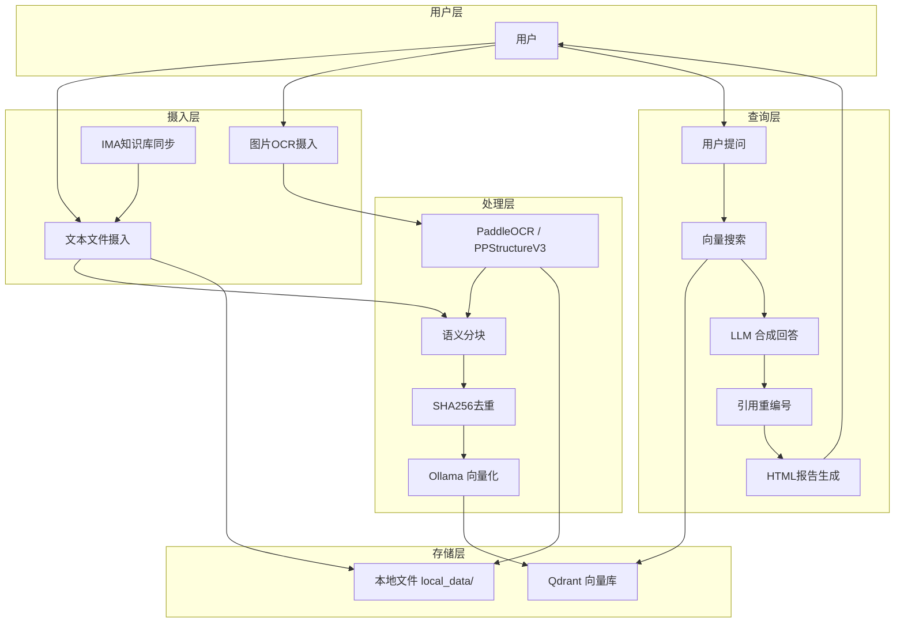

---

## 二、文档摄入流程

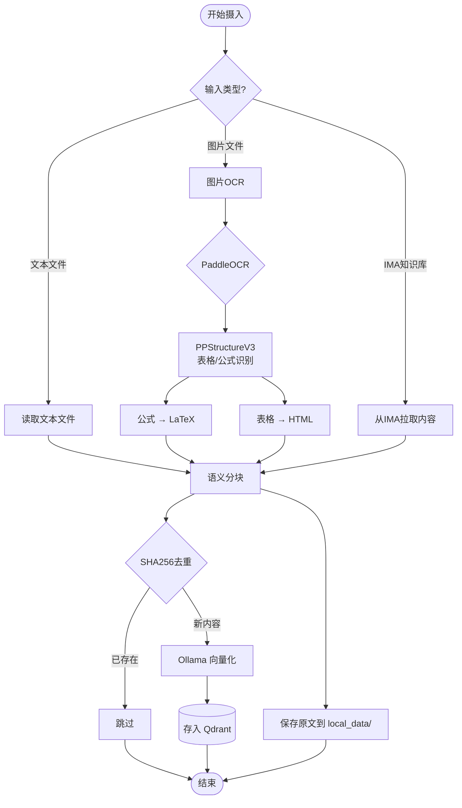

### OCR详细流程（含LLM优化）

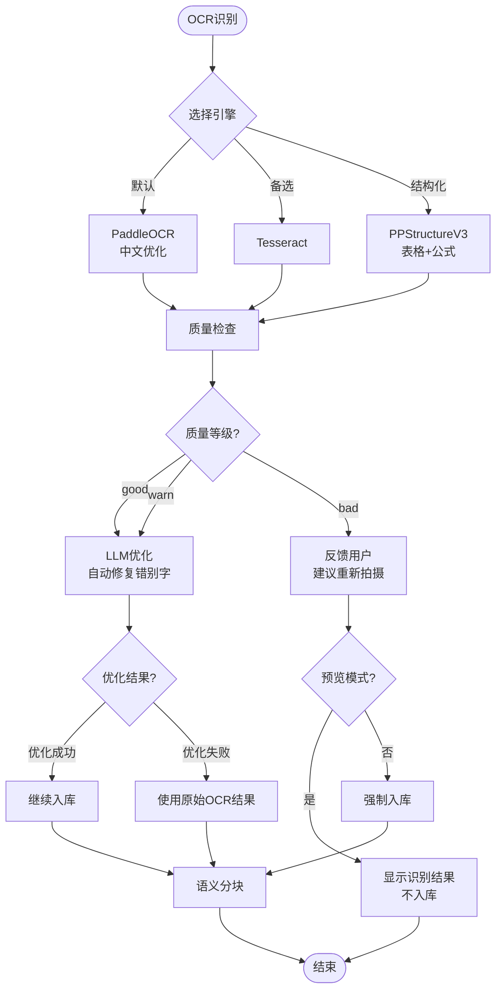

---

## 三、查询与回答生成流程

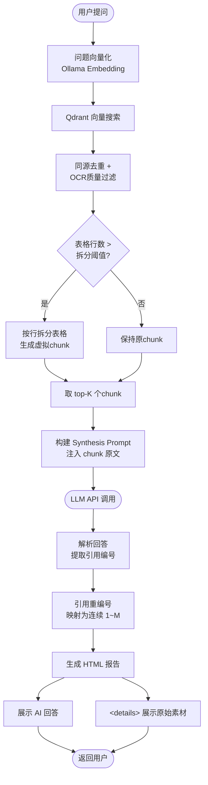

---

## 四、引用粒度优化流程（表格行拆分）

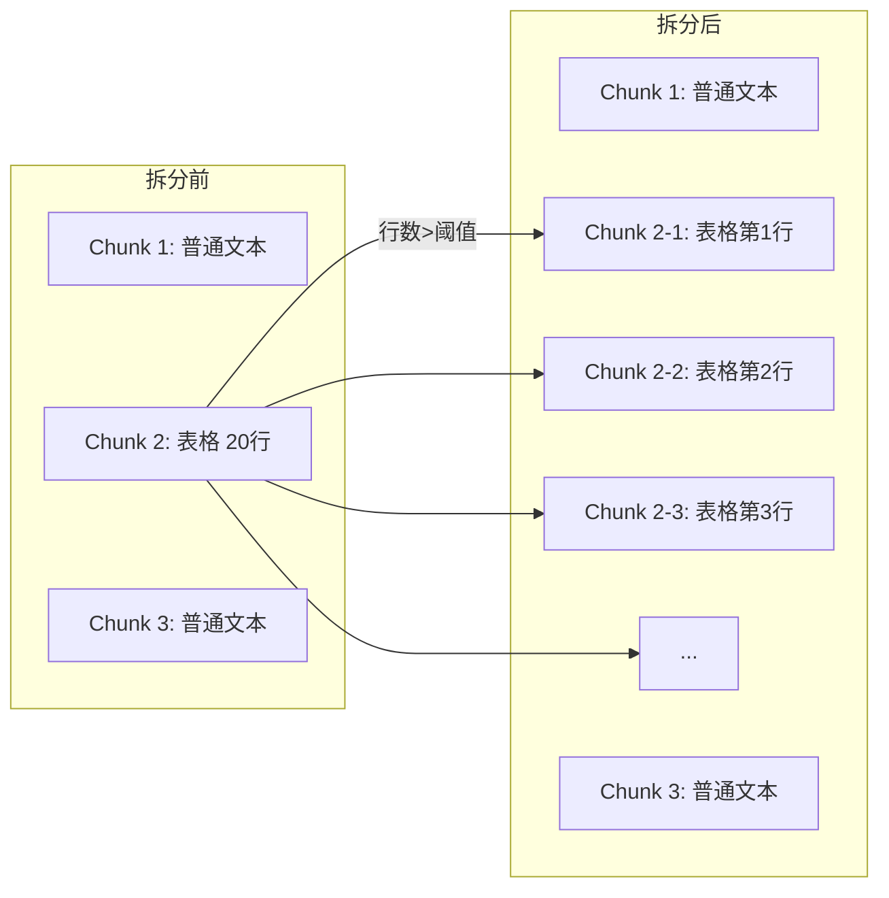

---

## 五、引用重编号逻辑

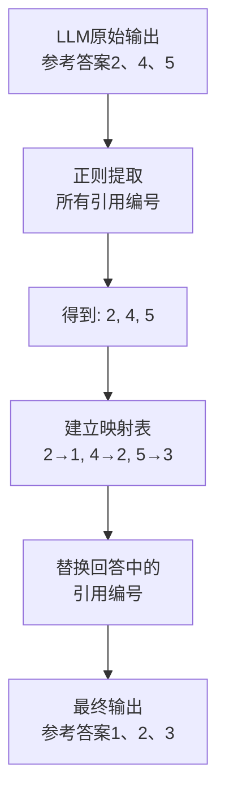

---

## 六、IMA 知识库同步流程

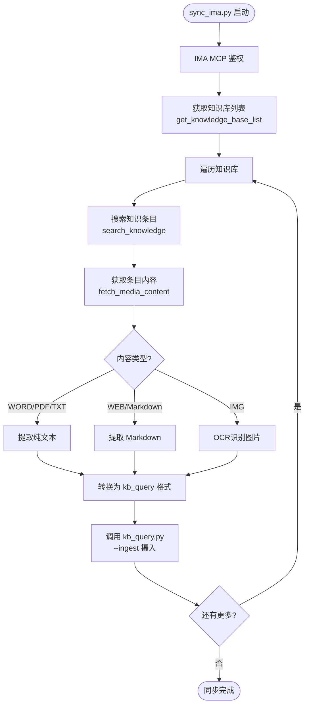

---

## 七、HTML 报告结构

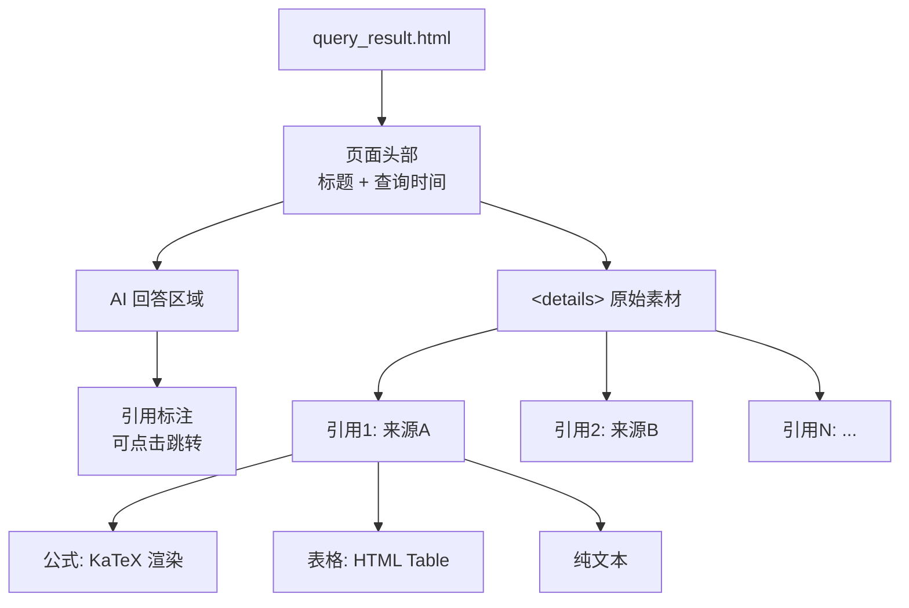

---

## 八、错误处理与重试逻辑

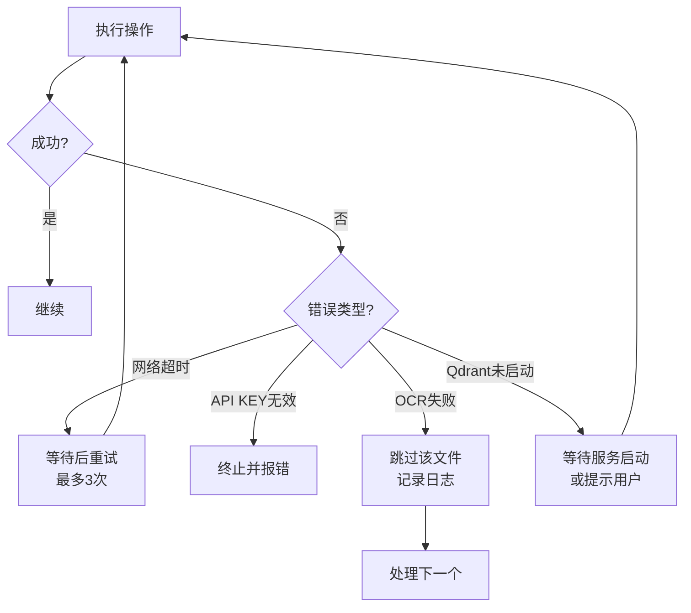

---

## 九、项目文件结构

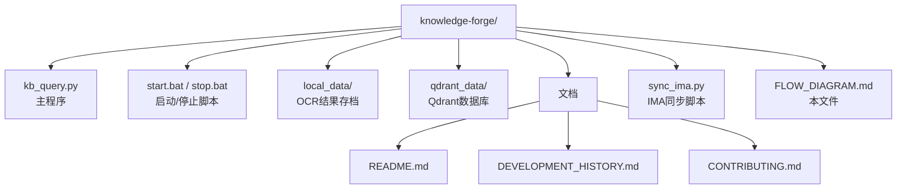

---

## 十、序列图：一次完整问答

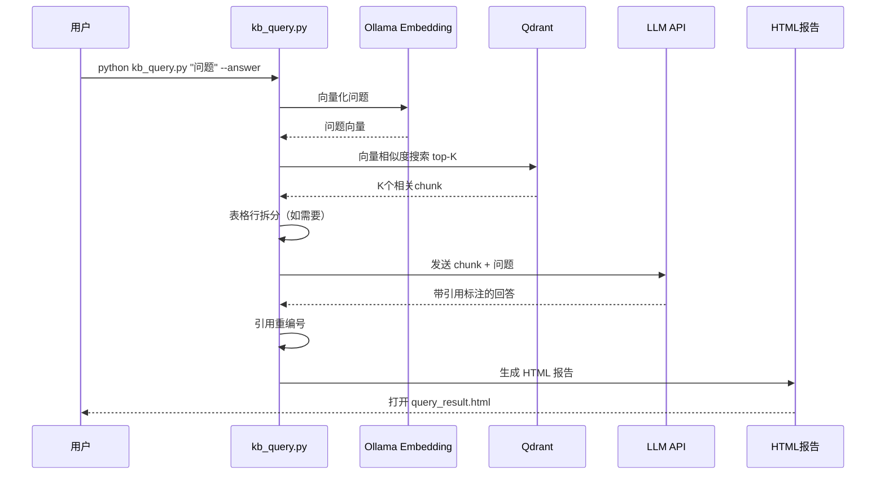
